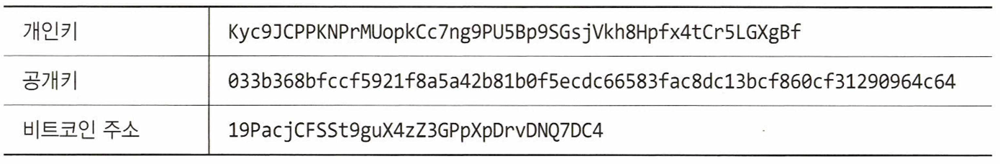

# 2장. 암호화폐에 내재된 가치

- 암호화폐는 보안 및 송수신에서 주요 차이점이 있다.
    - 블록체인 시스템에서는 의지할 곳 없이 자금을 잃을 수 있다.

## 암호화폐 시스템의 공개키와 개인키

---

- 비트코인 시스템에서 공개키 암호화는 필수 요소다.
    - 비트코인 지갑을 생성하면 공개키와 개인키, 비트코인 주소가 생성된다.
    - 비트코인 주소는 공개키를 변환한 것으로, 자금을 받을 수 있고 다른 주소로 보낼 수 있는 지갑의 ID다. 공유할 수 있다.
    - 개인키는 비밀로 유지되며 저장된 암호화폐를 잠금 해제하는 데 사용된다.
        
        
        
- 비트코인 개인키는 디지털로 거래에 서명하는 데 사용된다.
    - 비트코인 주소의 정당한 소유자임을 증명하고, 거래가 어떻게 승인되는지 증명한다.
- 비트코인 공개키는 비트코인 주소를 생성하는 데만 사용된다.
    - 비트코인 주소는 본질적으로 공개키의 압축 버전이므로 읽기가 훨씬 쉽다.

- 개인키는 무작위로 생성된 256비트 숫자다. 16진수 형식으로 표시돼 있다.
    - 개인키를 갖고 있다면, 공개키와 페어링해 비트코인 주소를 잠금 해제할 수 있다.
    - 개인키로 사용자는 공개키와 비트코인 주소를 생성할 수 있다.
        
        
        
        그림 2-1. 개인키에서 비트코인 주소를 찾는 과정
        

## UTXO 모델

---

- 비트코인 거래는 미지출 트랜잭션 출력(UTXO, Unspent Transaction Outputs) 방식을 따른다.
- 비트코인 거래는 입력 목록과 출력 목록으로 구분된다.
    - 입력: 과거에 받은 주소와 함께 자금을 제공하는 비트코인 주소가 있는 미지출 트랜잭션을 식별한다.
        - 비트코인 주소의 소유자가 그 거래를 승인한다는 것을 증명하는 디지털 서명이 포함돼 있다.
    - 출력: 비트코인 주소와 주소가 얼마나 많은 돈을 받는지 보여준다.
    - 입력값 - 출력값: 마이너가 받게 되는 거래 수수료


그림 2-2. 비트코인 블록 익스플로러의 모습과 샘플 트랜잭션

- 입력: 0.0128 BTC
- 출력: 0.01145732 BTC
- 입력 값 - 출력 값: 0.00134268 BTC
    - 블록체인에 블록을 발견한 마이너에게 수수료로 지급된다.

- 로우 트랜잭션의 예
    
    ```powershell
    01000000017967a5185e907a25225574544c31f7b059clal91d65b53dccl554d339c4f9efc010000006a47304402206a2ebl6b7b92051d0fa38cl33e67684ed064effadald7f925c842da401d4f22702201fl96bl0e6e4b4a9fff948e5c5d71ec5da53e90529c8dbdl22bff2bld21dc8a90121039b7bcd0824b9a9164f7ba098408e63e5b7e3cf90835ccebl9868f54f8961a825ffffffff014baf2100000000001976a914db4dli41d0048bledl5839d0b7a4c488cd368b0e88ac00000000
    ```
    
    - 구성요소
        
        
        | 항목 | 내용 |
        | --- | --- |
        | 버전 정보(Version no.) | 4바이트로 트랜잭션을 생성하는 노드가 사용하는 프로토콜 버전을 식별한다.
        현재 버전은 1이다.
        - 8자리 16진수, `01000000`(리틀 엔디언으로 저장됨), 빅 엔디언(정상적인 순서)으로 변환하면 `00000001`, 10진수 1이 된다. |
        | 플래그(Flag) | 0001 값을 나타내는 플래그가 있는 경우 노드는 트랜잭션에서 서명 정보를 제거하는 세그윗(SegWit, Segregated Witness)을 사용하고 있다는 것이다.
        - 바로 뒤에 `0001`이 존재하지 않음. 이 트랜잭션은 세그윗을 사용하지 않음. |
        | 입력 개수(In-counter) | 입력 개수
        - `01`: 1개, 입력 개수는 VarInt (Variable Integer) 방식으로 저장된다.
        • 1바이트(0x00 ~ 0xFC) → 입력 개수(1~252개)
        • 3바이트(0xFDxxxx) → 입력 개수(253~65,535개)
        • 5바이트(0xFExxxxxx) → 입력 개수(65,536~4294967295개)
        • 9바이트(0xFFxxxxxxxxxxxxxxxx) → 매우 큰 입력 개수 |
        | 입력 목록(List of inputs) | 입력된 데이터 목록
        - 트랜잭션 해시(Previous TxID): 이전 트랜잭션의 해시(32바이트, 리틀 엔디언)
        `7967a5185e907a25225574544c31f7b059c1a191d65b53dc1554d339c4f9efc`(32바이트, 리틀 엔디언), 실제 TxID: `fc9e4f9c39d35455dc53b5d6911a1c59b0f7314c547455252a790e5e18a56779`
        - 출력 인덱스(Vout, Index): 이전 트랜잭션에서 사용될 출력의 인덱스(4바이트, 리틀 엔디언)
        `01000000`(4바이트, 리틀 엔디언), `0x00000001` → 인덱스 1번 출력 사용
        - 스크립트 길이(ScriptSig Length): 스크립트 서명(ScriptSig)의 길이 (VarInt)
        `6a`(VarInt 형식, `0x6a` = 106 바이트)
        - 스크립트 서명(ScriptSig): 서명 및 공개키 포함 (가변 길이)
        1. 서명의 길이(1바이트): `47`(`0x47` = 71바이트)
        2. 서명: `304402206a2eb16b7b92051d0fa38c133e67684ed064effadad17f925c842da401d4f22702201f196b10e6e4b4a9fff948e5c5d71ec5da53e90529c8dbd122bff2b1d21dc8a90121`
        3. 공개키: `039b7bcd0824b9a9164f7ba098408e63e5b7e3cf90835cceb19868f54f8961a825`
        - 시퀀스 넘버(Sequence Number): 거래의 상대적 락타임을 설정하는 값 (4바이트)
        `ffffffff`(기본값), 타임락 기능을 활성화할 경우 다른 값이 설정됨 |
        | 출력 개수(Out-counter) | 출력된 데이터 개수
        - `01`: 1개 (1바이트, `0x01`) |
        | 출력 목록(List of outputs) | 출력된 데이터 목록
        - 출력 금액(Value): 8바이트, 리틀 엔디언
        `4baf210000000000` → `0000000021af4b`(16진수) → 2200000 사토시, 0.022 BTC
        - 스크립트 길이(ScriptPubKey Length)
        `19`(1바이트, `0x19` = 25바이트)
        - 스크립트(ScriptPubKey)
        `76a914db4dli41d0048bledl5839d0b7a4c488cd368b0e88ac`: `0x19`=25바이트, 표준 P2PKH (Pay-to-PubKey Hash) 스크립트. 수신자의 비트코인 주소에 해당하는 해시(20바이트)가 포함됨
        • 디코딩:
        `76                OP_DUP`(스택에 값 복사)
        `a9                OP_HASH160`(공개키를 RIPEMD-160 해시로 변환)
        `14                공개키 해시(PubKey Hash)의 길이`(`0x14`, 20바이트)
        `db4d...b0e        비트코인 주소의 해시`(공개키 해시)
        `88ac              OP_EQUALVERIFY OP_CHECKSIG`(서명 검증) |
        | 증인(Witnesses) | 세그윗을 사용하면 필드에는 증인 목록이 표시된다. |
        | 잠금시간(Lock time) | 4바이트로 필드가 비어 있지 않으면, 트랜잭션을 블록체인에 추가할 수 있는 가장 이른 시간을 식별한다. 이 필드는 블록 높이 또는 유닉스와 같은 타임스탬프로 표시될 수 있다.
        `00000000`: 4바이트, 0x00000000 = 0 (잠금 없음)
        • 즉, 이 트랜잭션은 즉시 유효하며, 특정 블록 높이까지 기다릴 필요 없음 |

- 기존 트랜잭션 (Legacy): 서명(Signature) 데이터가 트랜잭션 본문에 포함됨
    
    ```
    [Version] [Inputs] [Signature] [Outputs] [Locktime]
    ```
    
- 세그윗 트랜잭션 (SegWit): 서명(Signature) 데이터가 별도의 Witness 필드로 이동
    
    ```
    [Version] [Marker] [Flag] [Inputs] [Outputs] [Witness] [Locktime]
    ```
    
- cf> 세그윗
    - 비트코인의 기존 트랜잭션 구조에서는 서명 데이터가 트랜잭션 본문 안에 포함되어 있었다.
    - 문제점
        1. 블록 크기 제한 (Scalability Issue)
            - 비트코인의 블록 크기는 1MB로 제한되어 있어, 많은 트랜잭션을 포함하기 어려움
            - 트랜잭션의 약 60%가 서명 데이터였기 때문에 블록당 처리할 수 있는 트랜잭션 수가 적었음
        2. 트랜잭션 처리 속도 저하 (Transaction Throughput)
            - 블록 크기가 제한되다 보니, 많은 트랜잭션이 처리되지 못하고 네트워크 대기열에서 밀려남
            - 거래가 몰리면 수수료(Fees)가 상승하는 문제 발생
        3. 트랜잭션 가변성(Transaction Malleability)
            - 기존 방식에서는 서명(Signature) 데이터가 트랜잭션 해시에 영향을 미쳤음
            - 즉, 서명을 변경하면 트랜잭션 ID도 변경되는 문제가 발생
            - 이 문제는 2차 확장 솔루션(예: 라이트닝 네트워크) 구현을 어렵게 만듬
    - 세그윗의 해결 방법
        1. 블록 크기 확장 (실질적 4MB 증가)
            - 서명(Signature) 데이터를 별도 영역(Witness)으로 분리하여 저장
            - 기존 블록 크기 1MB 제한은 유지하되, 서명을 포함하는 새로운 세그윗 블록을 최대 4MB까지 확장 가능
            - 결과적으로 더 많은 트랜잭션을 한 블록에 포함할 수 있음
        2. 트랜잭션 처리 속도 개선
            - 서명 데이터를 제거하면서 트랜잭션 크기를 줄여 블록 내에서 더 많은 거래를 포함할 수 있음
            - 네트워크의 처리량(Throughput) 증가 → 거래 수수료 감소
        3. 트랜잭션 가변성 문제 해결
            - 트랜잭션 ID 계산 시 서명 데이터를 포함하지 않음
            - 이렇게 하면 서명을 변경하더라도 트랜잭션 ID는 변하지 않음
            - 라이트닝 네트워크 같은 2차 확장 솔루션을 구축할 수 있는 기반 마련
    
    → 현재(2024년 기준): 전체 비트코인 트랜잭션의 80% 이상이 세그윗을 사용
    
    - 수수료 절감과 속도 개선 효과로 점점 더 많은 월렛과 거래소가 세그윗을 지원

## 트랜잭션

---

- 트랜잭션: 한 주소에서 다른 주소로의 값 이동
- 컨펌(Confirmed)됐다: 블록체인에 게재된 트랜잭션
- 자금의 통제권을 양도하려면 개인키로 트랜잭션에 서명해야 한다. 그 후, 해당 공개키는 수신자가 서명을 확인하고 트랜잭션을 검증하는 데 사용된다. 사용자들은 트랜잭션이 성사되기 위해 네트워크에 소정의 수수료를 지불해야 한다.
- 수수료: 마이너들(거래가 포함된 블록을 발견)이 지속적으로 네트워크를 보호할 수 있도록 장려하기 위한 것

- 비트코인 수수료 추정기 및 계산기(Bitcoin Fee Estimator & Calculator): 원하는 시간에 블록체인에 기록하기 위해 트랜잭션에 얼마나 많은 수수료를 포함해야 하는지 추정하는 데 도움이 될 수 있다.
    - ex> [https://mempool.space/](https://mempool.space/)
    
    
    
    그림 2-3. 블록체인에 포함된 트랜잭션에 대한 수수료 추정
    
    - 트랜잭션 수수료는 네트워크 용량과 확인 속도에 따라 달라진다. 블록에 기록할 수 있는 트랜잭션의 수에는 제한이 있으므로(현재 데이터 1MB 또는 블록당 약 3500개 트랜잭션) 긴급성을 높이기 위해 더 높은 수수료가 필요할 수 있다.
        - 마이너들이 트랜잭션을 확인하도록 강요하는 경쟁이 일어나고 있다. 수수료가 인상되면 더 빠른 확인이 이루어진다.
        
        
        
        그림 2-4. 비트코인 트랜잭션 실행에 관련된 일련의 이벤트. 6번 ‘블록체인에서 채굴’은 마이너들이 네트워크에서 컨펌할 새로운 블록을 추가하는 것을 의미한다.
        

### 머클루트

---

- 머클루트: 256비트로 저장된 현재 블록의 모든 트랜잭션 상태를 스냅샷으로 보여줄 때 사용된다.
    - 네트워크의 모든 노드가 정확히 같은 트랜잭션 목록을 갖도록 해야 한다면, 각 트랜잭션을 개별적으로 비교해야 하지만, 머클루트를 사용하면 다른 모든 노드의 머클루트와 비교하기만 하면 되기 때문이다.
    - 머클트리의 구조
        
        
        
        그림 2-5. 샘플 머클트리의 흐름도
        
        - 현재 블록의 트랜잭션 해시를 잎(leaf)으로 사용한다.
    - 트랜잭션 수가 홀수이면 프로세스를 계속하기 위해 마지막 트랜잭션이 복제된다.
        - 머클루트는 블록 해시를 생성하는 데 도움이 되는 중요한 값이다.


그림 2-6. 비트코인 블록 #125552의 정보


그림 2-7. 머클트리의 흐름도

- 블록 #125552의 머클루트: `2b12fcf1b09288fcaff797d71e950e71ae42b91e8bdb2304758dfcffc2b620e3`
    - 첫 번째 트랜잭션의 tx 해시: Ha = `51d37bdd871c9elf4d5541be6736ab625e32028744d7d4609d0c37747b40cd2d`
    - 두 번째 트랜잭션의 tX 해시: Hb = `60c25dda8d41f8d3d7d5c6249e2ealb05a25bf7ae2ad6d904b512b31f997elal`
    - 세 번째 트랜잭션의 tx 해시: Hc = `01f314cdd8566d3e5dbdd97de2d9fbfbfd6873e916a00d48758282cbb81345b9`
    - 네 번째 트랜잭션의 tx 해시: Hd = `b519286al040da6ad83c783eb2872659eaf57blbec088e614776ffe7dc8f6d01`
- 머클루트까지의 해시
    - Ha+b(`H_A`, `H_B` 연결 후, 더블(2번) SHA-256 해시 적용) = `0d0eblb4c4b49fd27dl00e9cce555d4110594661blb8ac0534b8879c84959bd4`
    - Hc+d = `bfae954bdb9653ceba3721e85al22fba33585c5762b5ca5abell7b30c36c995e`
    - Ha+b + Hc+d = Merkle root = `2b12fcflb09288fcaff797d71e950e71ae42b91e8bdb2304758dfcffc2b620e3`

→ 블록체인 노드에서 조작을 신속하게 감지할 수 있다.

- 어떤 변조나 부패가 발생하면, 머클루트 해시는 더 이상 다른 노드와 일치하지 않을 것이다.

### 트랜잭션 서명 및 검증

---

- 트랜잭션 입력에는 보내는 주소의 소유자가 트랜잭션을 승인했다는 증거를 제공하는 서명이 포함된다.
    - 서명: 개인키와 트랜잭션 데이터를 입력으로 하는 암호화 알고리즘인 ECDSA를 사용해 생성되고 암호화된다.
        
        
        
        그림 2-8. 트랜잭션 서명을 생성하기 위한 암호화 프로세스
        
- 모든 노드가 트랜잭션을 검증할 때 ECDSA 검증 함수를 사용해 서명의 유효성을 쉽게 검증할 수 있다.
    
    
    
    그림 2-9. 트랜잭션의 서명 확인
    
    - 트랜잭션을 허가하는 디지털 서명이 유효한지 확인하는 데 개인키가 필요하지 않다.
- 모든 노드가 공개 정보를 사용해 트랜잭션을 쉽게 검증할 수 있지만 개인키가 필요하기 때문에 서명 자체를 생성할 수는 없다.

### 코인베이스 트랜잭션

---

- 코인베이스 트랜잭션: 모든 블록에 기록된 첫 번째 트랜잭션, 두 가지 값으로 구성된다.
    1. 블록보상
        - 마이너가 블록을 발견하고 네트워크로부터 받는 보상
        - 새로운 비트코인이 전체 공급에 추가되는 형태로 이뤄진다.
    2. 거래 수수료
        - 현재 블록에 추가되는 각 트랜잭션 수수료의 총합
        - 비트코인 수수료 사이트에서 평균 거래 수수료를 확인할 수 있다.

### 비트코인 트랜잭션 보안

---

## 해시

---

### 블록 해시

---

## 커스터디: 개인키는 누가 갖고 있는가

---

### 지갑 유형 : 수탁형과 비수탁형

---

### 지갑 유형 변형

---

## 보안 기본사항

---

### 복구 시드

---

## 채굴

---

### 채굴은 인센티브에 관한 것

---

### 블록 제너레이터

---

## 합의

---

### 작업 증명

---

### 지분 증명

---

### 합의를 위한 다른 개념

---

## 이해관계자

---

### 브로커리지

---

### 거래소

---

### 커스터디(보관 서비스)

---

### 분석(분석 서비스)

---

### 정보

---

## 요약

---
