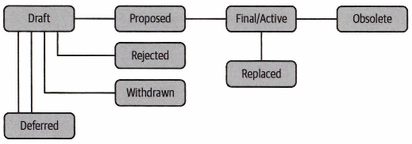

# 3장. 포크와 알트체인

## 비트코인 개선안

---

- 비트코인 프로토콜을 업데이트하려면 반드시 따라야 할 거버넌스 프로세스가 있다.
- BIP(Bitcoin Improvement Proposals, 비트코인 개선 사항): 소프트웨어 제품의 일반적인 개선 방식
    - 누가 제품을 소유하고 있는지, 누가 최종 결정권이 있는지 같은 기준을 고려하고 새 기능을 추가해야 할 때를 결정한다.

- BIP 수명주기
    1. 커뮤니티의 누군가가 개선 아이디어를 제시하고 BIP 편집자에게 제안한다.
    2. 편집자가 승인하면 초안 상태에 넣기 위해 새로운 BIP를 만든다.
    3. 마이너들이 BIP에 관한 지지 신호를 보내면 최종 상태로 이동한다. (마이너들이 소프트웨어를 업그레이드해야 하므로 동의해야 함)
    4. BIP가 최종 상태에 있다면 나머지 커뮤니티는 새로운 소프트웨어로 업그레이드해야 한다.

- BIP가 지역 사회에 의해 받아들여지려면 충족시켜야 하는 기준
    1. 형식인 BIP-0001을 따른다.
    2. 변경사항을 구현하는 코드가 제안서에 들어있다.
    3. 지금까지 발견된 2,016개의 블록 중 95%의 마이너들이 새로운 BIP를 사용해 만든 것이다.

- 비트코인의 민주적인 과정
    - 누구나 새로운 개선사항을 제안할 수 있다.
    - 마이너들은 유권자들이고, 해시레이트를 많이 가질수록, 더 많은 표를 얻는다.
        - 해시레이트: 1초에 몇 번이나 해시를 계산해보는지(못 풀어도 됨), 컴퓨터가 시도하는 연산량
    - 95% 이상의 해시파워를 얻으면 개선사항이 채택되어 반영된다.

- BIP 프로세스: [https://github.com/bitcoin/bips](https://github.com/bitcoin/bips)
    
    
    
    그림 3-1. 비트코인 개선 과정
    

## 포크에 관한 이해

---

- 비트코인 커뮤니티가 네트워크의 공동 이익을 위해 함께 모이기 시작하면서, 많은 개발자들이 소프트웨어 포크를 통해 개량한 비트코인을 만들기 시작했다.
- 그 결과로 알트코인(Altcoin), 알트체인(Altchain) 이 탄생했다.

- 소프트웨어 포크: 소프트웨어의 일부를 가져다가 필요에 따라 일부 매개변수를 변경하는 것
- 소프트포크: 블록체인 기술과 관련해 네트워크를 변경하지만 모든 채굴자가 참여할 필요는 없다. 이전 소프트웨어와 호환된다.
- 하드포크: 블록체인 기술과 관련해 채굴 소프트웨어를 업그레이드해 네트워크를 바꾸는 것으로 모든 채굴자가 참여해야 한다. 이전 소프트웨어와 호환되지 않는다.
    - 하드포크 시점부터 두 체인은 서로 다른 트랜잭션을 기록하고 소프트웨어도 호환되지 않는다.

### 논쟁을 불러온 하드포크

---

- 논쟁의 여지가 있는 하드포크가 발생하면 암호화폐의 메인 블록체인이 두 개의 분리된 블록체인으로 쪼개진다.
    
    
    
    그림 3-2. 하드포크 이후에 생성된 비트코인 및 비트코인캐시 블록
    
- 과거 기록은 동일하나, 이후 블록은 각각 따로 생성된다. → 서로 다른 블록체인

### 마이너

---

- 마이너는 해시파워를 어디에 쓸지 선택하며, 지지하는 소프트웨어를 따라 채굴한다.
    
    
    
    그림 3-3. 포크 이후 비트코인 및 비트코인캐시 클라이언트 버전
    
- 해시파워는 블록체인의 신뢰도에 영향을 미친다.
    - 노드 수와 해시파워가 많을수록 신뢰도가 높다.(더 탈중앙화 됨)
- 비트코인 커뮤니티 블록체인: 비트코인, 비트코인캐시, 비트코인SV
    - 비트코인의 해시레이트가 단연코 가장 높다.
        
        
        
        그림 3-4. 2020년 7월 기준 각 네트워크의 해시레이트, 비트코인의 해시레이트가 포크보다 우수하다.
        

### 리플레이 공격

---

- 하드포크 후 양쪽 체인에서 동일한 서명 방식을 사용하면, 한 체인의 거래가 다른 체인에서도 유효할 수 있다.
    - 이로 인해 합법적인 거래가 복제되거나 미리 실행되는 공격이 가능하다.
    
    
    
    그림 3-5. 포크 이후에 리플레이 공격이 일어나는 예
    
- 이를 방지하기 위해 비트코인캐시는 트랜잭션 데이터에 `SIGHASH_FORKID`를 포함하도록 변경함
    - 트랜잭션 데이터가 두 블록체인에 다르게 구조화돼 있음
    - 비트코인 코어 블록체인에 생성되는 서명은 비트코인캐시 블록체인과 다르고 유효하지 않다.

## 비트코인캐시 포크

---

- 비트코인 커뮤니티는 블록 크기 제한 문제로 갈라졌다.
    - 비트코인캐시: 기존 1MB → 8MB로 블록 크기를 늘림. 2018년 5월, 32MB로 추가 확장
    - 비트코인SV: 다시 128MB로 설정하며, 스마트 컨트랙트 구현도 목표

## 알트코인

---

- 알트코인: 비트코인 코어 소프트웨어의 포크
- ex>
    - 아이엑스코인: 초기에 채굴된 알트코인
    - 솔리드코인: 블록타임 3분 (비트코인은 10분)
    - 제이스트겔드: 블록타임 15초
    - 네임코인: 탈중앙화 DNS
    - 프라임코인: 소수점을 찾는 작업 증명

### 라이트코인

---

- 비트코인의 4배 공급량, 블록타임도 비트코인의 4배 이상
- 프리마인은 하지 않기로 결정

### 더 많은 알트코인 실험

---

- 도지코인: 밈에서 출발, 총 발행 코인 수에 상한선이 없음. 낮은 가격.
- 언옵테늄: 희귀한 원소 컨셉, 발행량 25만 개로 제한.
- 코인예: 케니 웨스트를 밈으로, 상표권 침해 통지를 받고 법적 압력으로 중단됐다.
- 팟코인: 대마초 산업을 위한 코인, 시장 규제로 채택이 어려워졌다.

## '2.0' 체인

---

- 비트코인 포크 외에 처음부터 구축한 프로젝트들, 이타적인 아이디어라면 목표를 달성하기 위해 근본적으로 만들어져야 한다.

### 넥스트

---

- 2013년 출시. 초기 '비트코인 2.0' 또는 '블록체인 2.0' 프로젝트
- 좀 더 프로그래밍적이고 유연한 블록체인 아이디어
- 암호화폐와 원장(Ledger)을 대신하여 애플리케이션 구축 가능한 플랫폼 제공 목표
    - 자산, 주식/채권 또는 상품 같은 실체 자산을 나타내기 위해 암호화폐를 '색칠'하는 컬러 코인의 아이디어 최초 소개
- 익명의 사람이나 그룹이 개발. 실제로는 서비스하지 못했으나, 개념은 이후 블록체인에 중요한 인상 남김

### 카운터파티

---

- 최초의 '비트코인 2.0' 프로젝트 중 하나. 2014년 출시
- 마스터코인처럼 비트코인의 블록체인 확장 프로토콜, 더 많은 프로그래밍 기능 제공 목표
- 암호 기반 블록체인 자산을 만들 수 있도록 설계
- 블록체인 애플리케이션에 비즈니스 논리를 제공하는 코드 포함한 스마트 콘트랙트가 특징
- XCP라는 자체 암호화폐를 갖고 있다.

## 개인정보 보호에 중점을 둔 암호화폐

---

- 암호화폐가 확산된 후 많은 사람들이 블록체인에 얼마나 많은 금융 데이터가 보관되고 있는지 우려하게 되었고, 프라이버시에 중점을 둔 암호화폐가 등장하기 시작했다.

### 대시

---

- 2014년 출시, 비트코인 소프트웨어 포크. 다크코인 낙인찍혀 평판이 좋지 않았다.
- 프라이빗샌드(PrivateSend)라는 트랜잭션 혼합 기능 포함 → 추적 불가하게 구현
- 2018년, X11 라는 ASIC 저항 작업 증명 구현

### 모네로

---

- 2014년 출시, 작업 증명을 위해 크립토노트(CryptoNote) 프로토콜 사용
- 링 시그니처(Ring Signature) 디지털 서명 기술 사용 → 익명성 제공
- 스텔스 주소, 링 기밀 거래와 같은 개념도 프라이버시 기능으로 제공한다.

### 지캐시

---

- 2016년 출시, 가장 잘 알려진 개인정보 보호 체인 중 하나
- 해시를 사용하면 암호화 시스템의 개인정보를 침해할 수 있다.
    - 원장(공개적으로 볼 수 있음)은 해시를 사용하기 때문에 블록체인 기반 암호화폐를 포함할 수 있다.
        - 누가 어떤 주소로 얼마나 보냈는지 추적 가능
    
    → 영 지식 증명(zk-SNARKs) 사용
    
    - 영 지식 증명(zero-knowledge proof): 거래 상대방에게 어떠한 정보도 제공하지 않은 채, 자신이 해당 정보를 갖고있다는 사실을 증명하는 것
    - 실제 데이터를 공유하지 않고 정보 전달 가능
        - 거래를 체결할 때, 발신자·수신자·금액은 숨겨지고, 대신 해당 거래가 유효하다는 zk-SNARK 증명만 블록체인에 기록된다.(개인정보는 보호된다)
- 고정 공급량 2,100만 개, 거래는 투명할 수 있다.
    - z-addr를 구현해서 거래를 보호해야 함
- 연구에 따르면 지캐시코인의 3.5%만이 보호 주소에 보관돼 있다.

## 리플과 스텔라

---

- 소프트웨어 포크로 비트코인 기반 작업 증명 합의 알고리즘이 적용된 암호화폐들이 많은 비판을 받았다.
    - 비트코인과 같은 암호화폐 네트워크에서 중앙 집중화가 점점 많아지고 있음
    - 비트코인 채굴의 65% 이상이 중국에서 이뤄짐
- 리플(Ripple), 스텔라(Stellar): 작업 증명 방식을 사용하지 않는 암호화폐로 성공

### 리플

---

- 2012년 출시, 비트코인에 영향 받아 탄생. 대안 암호화폐 중 가장 오래됨
- 초창기엔 암호화폐와 무관한 프로젝트였고, '리플페이'라는 이름으로 국제 송금 서비스 제공
- 이후 리플랩스(Ripple Labs)라는 회사 설립, XRP라는 암호화폐 개발
    - 공동 개발자: 제드 맥칼렙(Jed McCaleb), 크리스 라슨(Chris Larsen)
- XRP 합의 프로토콜 기반. 트랜잭션에 대한 노드 합의가 필요한 비잔틴 장애 허용 (Byzantine Fault Tolerant, BFT) 정책 사용
    - 리플에서 자체 개발한 합의 메커니즘으로, 비트코인처럼 작업증명(PoW)을 사용하지 않는다.
- 은행 및 결제 분야 기업과 파트너십 다수
    - 머니그램(MoneyGram)에 5,000만 달러 규모 주식 투자함

### 스텔라

---

- 2014년 제드 맥칼렙과 조이스 김(Joyce Kim)이 설립
- 비영리 스텔라 개발 재단의 지원, 전 세계 저비용 지불 네트워크 제공 목표
- 초기에 리플과 유사한 합의 메커니즘 사용
    - 2015년 데이비드 마지에르스(David Mazieres)의 SCP로 변경
        - 2014년 스텔라 블록체인이 포크되면서 두 개의 별도 네트워크가 생겨 트랜잭션 문제 발생
- 스텔라는 은행이 부족한 곳에 금융 서비스 제공에 집중

## 블록체인 확장

---

- 확장성: 네트워크가 효율성을 개선하거나 유지하면서 리소스 할당을 동적으로 변경할 수 있는 능력
    - 비트코인은 초당 3~7개의 트랜잭션만 처리 가능
    - Visa는 초당 6만 5000건의 거래가 가능
- 처리 속도를 위해 원장에 기록되는 트랜잭션 수를 줄이거나 블록 사이즈를 최소화하려는 시도 존재
- 일부 관계자들은 데이터를 체인 밖으로 빼내는 것을 권장(오프체인)

### 세그윗

---

- 2015년 에릭 롬브로조, 존슨 라우, 피터 윌라에 의해 제안
- 서명 부분을 위트니스 영역으로 분리하여 데이터 구조 최적화
    - 블록 크기 계산에서 제외되어, 처리량 증가
- 트랜잭션 위·변조 문제인 트랜잭션 가변성(Transaction Malleability) 문제 해결
    - 트랜잭션 가변성: 블록으로 확인되기 전에 비트코인 트랜잭션의 고유 식별자 변경할 수 있는 공격
- 2017년 8월, 비트코인 소프트 포크로 업그레이드
    
    
    
    그림 3-7. 세그윗 적용 전 블록과 세그윗이 적용된 블록 간의 기술 비교
    

### 라이트닝

---

- 2016년 조셉 푼, 타데우스 드리야가 제안
- 일부 비트코인 거래를 별도의 채널에 올려놓고, 메인 비트코인 블록체인에서 신뢰 없이 처리
    
    → 메인 체인 부담 감소
    
    - 블록이 가득 차고 수수료가 늘어감에 따라 문제가 됐던 소비자 결제와 소액 결제 해결 가능
- 거래 확인: 블록이 아닌, 당사자 간 서명을 통해 처리
    - 해시 시간 잠금 계약(HTLC)이라는 다중 서명 시스템으로 거래 보장
- 보안 이슈
    - 2018년 서비스 공격으로 네트워크의 20% 다운
    - 당사자 간에 거래가 발생하려면 노드가 열려있어야 한다.
    - 부정행위 방지를 위한 감시용 노드 필요

### 기타 알트체인 솔루션

---

- 블록체인 트랜잭션 처리 속도 향상 솔루션: 상태 채널, 사이드 체인
    
    
    | 항목 | 상태채널 | 사이드체인 |
    | --- | --- | --- |
    | 참여자 수 | 보통 2명 또는 소수 | 다수 참여자 가능 |
    | 블록 구조 | 블록 없음 (서명된 상태만 주고받음) | 자체 블록체인 존재 |
    | 합의 알고리즘 | 없음 (참여자 서명만으로 상태 변경) | 독립된 합의 알고리즘 사용 |
    | 보안 의존성 | 메인체인에 의존 (이중 지불 방지 등) | 보통 자체 합의 보안 사용 (메인체인과 분리) |
    | 온체인 기록 | 채널 열고 닫을 때만 메인체인 기록 | 주기적 체크포인트나 자산 이동에만 메인체인 사용 |
    | 속도와 비용 | 매우 빠름, 거의 무료 | 빠르지만 보안 검증 비용 발생 가능 |
    | 대표 예시 | Lightning (BTC), Raiden (ETH) | Polygon PoS, RSK (BTC), Loom (ETH) |
    - 상태채널(State Channel): 블록체인 밖(오프체인)에서 여러 건의 트랜잭션을 빠르게 처리한 뒤, 최종 결과만 블록체인에 기록하는 방식
        - 사용자는 채널을 열고(온체인) → 여러 거래를 오프체인에서 주고받고 → 채널을 닫을 때(온체인) 최종 결과만 블록체인에 기록
        - 라이트닝 네트워크: 비트코인의 상태채널 방식
        - 라이덴: 이더리움의 상태채널 방식
    - 사이드체인
        - 플라스마(Plasma) 롤업 → 🤔 ChatGPT는 사이드체인은 아니라고 함
- 롤업: 수천 건의 트랜잭션을 오프체인에서 묶고, 요약본만 메인 체인에 기록
    - 낙관적 롤업(Optimistic), ZK 롤업 등 존재
        - 낙관적: 간단, 확장성 느림(500건 TPS)
        - ZK: 빠름(2000건 TPS), 복잡
- 질리카(Zilliqa), NEAR 등은 샤딩(Sharding) 사용 → 네트워크 병렬 처리

## 이더리움 클래식 포크

---

- 2016년 6월, DAO 해킹으로 발생
- 이더리움 커뮤니티는 둘로 나뉨
    1. DAO 해킹 복구 위해 이더리움 코드 업데이트
    2. 소프트웨어 유지
- 블록 #192만에서 분기 발생
    - 이더리움: 해킹 복구된 새 코드 적용
    - 이더리움 클래식: 기존 상태 유지
- 주소 분리로 리플레이 공격 방지
    
    
    
    그림 3-8. 이더리움(ETH) 및 이더리움 클래식(ETC)에 대한 리플레이 공격으로부터 보호
    
- 2016년 11월, 이더리움 개선안 155(EIP155)을 통해 리플레이 보호 구현했다.
    - 스퓨리어스 드래곤 하드포크에 포함됐다.

## 요약

---

- 알트코인과 알트체인은 블록체인과 암호화폐로 무엇을 할 수 있는지 알 수 있는 흥미로운 주제
- 암호화폐 프로젝트를 이해하는 것은 중요하다. 과거 사례, 개념을 알아둬야 한다.
