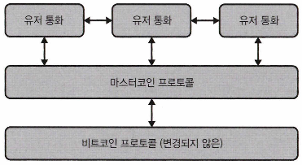

# 4장. 이더리움으로 진화

## 비트코인의 제한된 기능 개선

---

- 비트코인은 스크립트 머니 개념을 적용한 최초의 탈중앙화 합의 프로토콜
    - 제한된 기능성으로 인해 스크립트된 화폐라는 비유가 더 적합
- 화폐로서의 기능과 저장 수단에 대한 시각차로 논쟁이 일어났다.
    - 개발자 커뮤니티는 신중하고 제한적인 프로토콜 변화를 추구함
- 일부 비트코인 개발자들은 새로운 블록체인을 만드는 방법을 고안하기 시작
    
    → 비트코인은 프로그래밍이 가능한 돈이 될 수 있는 토대가 됐다.
    

### 컬러드 코인과 토큰

---

- 컬러드 코인은 비트코인 블록체인이 아닌 위에 구축됨
- 토큰: 기존 블록체인 위에 독특한 원장을 프로그래밍해 만든 가치 단위
    - 비트코인에 컬러드 코인이 등장하면서 타 블록체인 토큰도 생겨났다.
    - 이더리움 생태계 발전의 기반이 되었다.

### 마스터코인과 스마트 콘트랙트

---

- 2013년에 마스터코인 개발
- 비트코인 기능을 확장
    - 스마트 콘트랙트, 토큰 개념 도입
- 이전에는 소프트웨어 포크 밖에서 새 암호화폐를 만들기 어려웠으나 이를 해결했다.

### 옴니레이어의 이해

---

- 스마트 콘트랙트 기반 자산 전송 및 거래 기능 제공
- 비트코인 블록체인 위에 별도 레이어 구성
    
    
    
    그림 4-1. 옴니레이어의 기술 스택 개요
    
- 메이드세이프코인(MAID)과 테더(Tether) 등이 대표적인 사례

- 테더: 스테이블코인. 미국 달러에 고정된 암호화폐
    - 테더 백서에 따르면 1달러에 고정
    - 회계감사 약속했으나 이행하지 않음
    - 여전히 실험적인 상태로 검증 필요

- 옴니레이어의 작동 방식: 누구나 화폐를 만들 수 있음
    - 중앙집중형 거래소 대신 트레이드 코드 실행
    - `OP_RETURN` 필드 사용하여 메타데이터 저장. 트랜잭션 기록에 사용된다.
        
        
        
        그림 4-2. 비트코인 블록체인에서 옴니 트랙잭션의 예
        
        - 그림 4-2 `OP_RETURN` 필드: 6f6d6e69000000000000001f00001dcd6500
            
            
            
            표 4-1. OP_RETURN 변환 표
            

## 이더리움: 마스터코인을 한 단계 끌어올리기

---

- 이더리움: 비트코인과 마스터코인의 개념을 기반으로 하는 기능적이고 일반적인 연산 프로토콜
    - 2013년 비탈릭 부테린이 처음 제안, 개빈 우드와 함께 개발했다.
    - 목표: 마스터코인을 한 단계 끌어올리는 것
- 최초에는 PoW 방식 사용, 2022년 9월에 마이닝 폐지 및 PoS 방식으로 변경했다.

### 이더와 가스

---

- 이더(Ether): 이더리움에서 계정 단위로 작동, 주소는 `0x` 시퀀스로 시작한다.
- 비트코인은 UTXO 방식(미사용 출력), 이더리움은 계정-잔액(Account/Balance) 추적 방식
    - 비트코인: 사용하지 않은 트랜잭션의 출력(UTXO)을 추적해서 잔액을 계산
    - 이더리움: "A가 B에게 1 ETH를 보냈다" → A의 계좌에서 1 ETH 차감되고 B의 계좌에 1 ETH가 더해짐
- 가스(Gas): 계정 단위, 이더리움 플랫폼에서 애플리케이션 실행에 사용된다.
    - 정지 문제 또는 무한 루프 코드를 방지할 수 있다.

### 사용 사례: ICO

---

- ICO(Initial Coin Offering): 자금을 암호화폐로 조달
    - 전통적인 기업이 자금을 조달할 때 주식을 발행해 투자금을 받는 IPO(Initial Public Offering)처럼, 블록체인 프로젝트에서 토큰을 발행해 투자자들로부터 자금을 받는 방식
    - 신뢰 플랫폼 요구, 스마트 콘트랙트 플랫폼이 등장했다.

### 탈중앙화된 자율 조직

---

- DAO 개념: 스마트 콘트랙트를 통해 중앙집중화 제거
- 분산형 거버넌스 시스템: 특정 중앙 주체 없이, 다수의 참여자들이 공동으로 규칙을 만들고 결정하며 운영하는 시스템
    - 'The DAO' 프로젝트 (2016년): 이더리움 위에 구축된 스마트 콘트랙트 기반의 ICO 프로젝트
        - 모금된 자금을 기술 프로젝트에 투자하는 결정: 토큰 소유자들의 투표로 이뤄졌다.
        - 약 1억 5천 4백만 달러 이상의 자금을 모금했다.

- 이더리움의 포크로 탄생된 이더리움 클래식
    - 재귀 호출 취약성으로 DAO 해킹당함
    - 문제 해결 위해 기존 이더리움에서 포크 발생 → 이더리움과 이더리움 클래식으로 분리되었다.
        - DAO 해킹을 없던 일로 만드는 것에 대한 의견 차이가 있었던 포크(불변성의 원칙 위반)

- 기타 이더리움 포크
    - DAO 해킹 사건은 포크 개념을 알리는 계기가 됐다.
    - 코드 결함 대응 및 취약점 보완을 위해 여러 차례 포크를 거쳤다.
    
    → 이더리움 생태계는 포킹이 불변성의 개념을 유지하는 것보다 더 내은 대안으로 여겼다.
    

### 이더리움 생태계의 주요 조직

---

- 이더리움 재단
    - 로드맵 개발 및 구현 주체, 스위스 비영리 법인
    - 플랫폼과 관련된 확장성 프로젝트에 자금을 지원한다. ex> 플라즈마(Plasma)

- 기업용 이더리움 연합 (EEA)
    - Enterprise Ethereum Alliance 회원사: IBM, 마이크로소프트
        - 애저(Azure)에서 이더리움 블록체인 서비스를 운영할 수 있도록 지원하고 있다.
    - 목표: 기업 비즈니스 환경에서 블록체인 특화된 사용 사례를 찾는 것
    - 프라이빗 블록체인 중심 작업

- 패리티 (Parity)
    - 개빈 우드가 설립한 회사, 이더리움을 쉽게 배포할 수 있도록 프레임워크 및 개발자 도구를 배포했다.
    - 멀티 시그 디지털 지갑 해킹으로 3천만 달러 피해가 발생되었다.(DAO 이후 두번째로 큰 해킹)
        - 코드에서 지갑 주소를 변경했다.

- 컨센시스 (ConsenSys)
    - 조셉 루빈이 설립한 회사, 개발자 도구 및 이더리움 네트워크용 블록체인 교육 제공한다.
    - 트러플 스위트, 깃코인, 메타마스크(MetaMask) 등 개발.
    - 다양한 디앱(DApp) 및 유용한 응용 프로그램을 만드는 프로젝트에 자금을 지원한다.

## 탈중앙화 애플리케이션

---

- 스마트 콘트랙트를 통해 실행되는 애플리케이션
- 스마트 콘트랙트와 상호작용하는 백엔드 및 프론트엔드 UI로 구성된다
    - 서버는 클라이언트/서버 아키텍처와 유사하며, 스마트 콘트랙트를 실행시키기 위한 블록체인의 일부다.
- 가장 큰 플랫폼: 이더리움
- 분산 시스템 구성요소: 분산된 컴퓨터 리소스에 위치하며 리소스 간에 통신이 이뤄지는 시스템

### 사용 사례

---

- 디앱의 주요 특징: 불변성
    - 블록체인에 게시된 후에는 코드를 변경할 수 없다.
    
    → 중앙집중화 시스템에서 병목 현상이 있는 곳에서 많이 사용된다.
    
- 디지털 자산의 효율적이고 안전한 이전이 가능하다.
    - ex> 비트토렌트: 검열과 암호화를 통한 프라이버시를 제공

### 디앱의 개발 과제

---

- 구현, UX, 속도, 확장성 문제가 있다.
- 코드에 중대한 결함이 없는지 확인해야 한다.
    
    → 콘트랙트 갱신 및 데이터 마이그레이션이 쉽지 않기 때문이다.
    

- 디앱 개발자는 테스트넷 및 보안 감사를 받아 보고서를 공개한다.
- 새로운 스마트 콘트랙트 코드를 배포하면 사용자 경험이 저하될 수 있다.
    - 인기있는 디앱의 경우, 네트워크에서 엄청난 수의 트랜잭션이 생성되면서 문제가 된다.
    - 열기가 식기 전까지는 사실상 디앱을 사용할 수 없게 된다.
- 🐱 크립토키티: 디지털 고양이를 수집하고, 교배하고, 사고팔 수 있는 블록체인 기반 게임
    - 2017년에 캐나다의 Dapper Labs가 개발
    - 각 고양이는 고유한 유전자를 가진 NFT 형태로 존재
    - ERC-721이라는 NFT 표준을 최초로 사용한 대표 사례 중 하나
    
    | 특징 | 설명 |
    | --- | --- |
    | **NFT 기반** | 모든 고양이는 고유한 ID와 유전자를 가진 NFT로, 진짜 ‘디지털 희소성’을 가짐 |
    | **교배 시스템** | 서로 다른 고양이를 교배해 새로운 고양이를 생성할 수 있음 |
    | **소유권의 진정한 의미** | 고양이 NFT는 사용자의 지갑에 귀속되어, 개발자조차 삭제하거나 통제 불가 |
    | **마켓플레이스 내장** | 사용자 간 자유롭게 고양이를 사고팔 수 있음 (이더리움으로 거래) |
    - 2017년 말 이더리움 네트워크의 트랜잭션 병목 현상을 일으킬 만큼 폭발적인 인기를 끌었다.
    - 일부 희귀 고양이는 수천만 원~수억 원에 거래되기도 했다.
    - 이로 인해 "블록체인으로 게임도 되고 수집도 되고, 돈도 벌 수 있다"는 인식이 퍼졌다.
    - 의의
        - NFT 붐의 시초
            
            지금의 NFT 아트, 게임, 프로필 사진 프로젝트(PFP)들이 나오게 된 기반을 마련했어요.
            
        - ERC-721 표준 탄생
            
            크립토키티 팀이 만든 NFT 표준이 이더리움 공식 표준이 되었고, 이후 NFT 대부분이 이 포맷을 따르게 되었어요.
            
        - 디앱(DApp)의 대중화
            
            사람들이 "이더리움 위에서 돌아가는 앱"을 실생활에서 체험할 수 있게 만든 첫 사례였어요.
            

## 이더리움에서 스마트 콘트랙트의 배치 및 실행

---

### 이더리움 가상머신

---

- EVM을 사용하면 개발자가 쉽게 디앱을 만들고 네트워크에서 실행할 수 있다.
- EVM의 목적
    1. 개발자가 스마트 콘트랙트를 블록체인에 도입할 수 있도록 한다.
    2. 마이너에게 EVM 스마트 콘트랙트 코드를 실행하는 방법을 지시한다.

- 스마트 콘트랙트 작성
    - 언어: 솔리디티(Solidity)
    - 도구: 트러플 스위트(Truffle Suite)
    - 스마트 콘트랙트와 상호작용하려면 이더리움 지갑이 필요하다. ex> 메타마스크(MetaMask)
    - 테스트넷: 스마트 콘트랙트를 위한 이상적인 스테이징 환경

- 스마트 콘트랙트 배포
    - 툴: 리믹스(Remix)
    - 배포 버튼 클릭 → 트랜잭션 데이터를 메타마스크로 전송
    - 트랜잭션이 승인된 후, 메타마스크는 스마트 콘트랙트 생성 트랜잭션을 네트워크로 전송한다.
        
        
        
        그림 4-5. 스마트 콘트랙트를 생성한 트랜잭션의 세부 정보
        
        - Value: 0 Ether, 이더가 전송되지 않았음을 의미한다.
        - 거래는 #5357662 블록에 기록돼 있다.
        - 이 블록을 발견한 마이너는 0.00137715 Testnet ETH(tETH)의 거래 수수료를
        받는다.
    - 네트워크가 트랜잭션을 처리한 후 공간이 작은 바이트 코드 형식으로 이더리움 네트워크에 스마트 콘트랙트를 저장한다.
        
        
        
        그림 4-6. 스마트 콘트랙트 코드가 개발에서 프로덕션으로 이동할 때 겪는 다양한 계층
        
    - 스마트 콘트랙트가 만들어지면 이더리움 주소가 주어진다.
        
        
        
        그림 4-7. etherscan.ioO|| 배포한 후 공개된 스마트 콘트랙트 코드
        

- 스마트 콘트랙트의 상호작용
    - 게스트북: 이더리움 테스트넷에 배치된 스마트 콘트랙트. 데이터 읽기/쓰기 가능해졌다.
        - 계약의 응용 프로그램 이진 인터페이스(Application Binary Interface)에 대한 참조가 필요하다.
    - ABI: 스마트 콘트랙트의 API와 같다. 기계 판독이 가능하다.
    - 게스트북 스마트 콘트랙트의 ABI
        
        ```json
        [
          {
            "constant": true,
            "inputs": [
              {
                "name": "_bookentrynumber",
                "type": "uint256"
              }
            ],
            "name": "getmessagefromreader",
            "outputs": [
              {
                "name": "_messagefromreader",
                "type": "string"
              }
            ],
            "payable": false,
            "stateMutability": "view",
            "type": "function"
          },
          {
            "constant": true,
            "inputs": [],
            "name": "getnumberofmessagesfromreaders",
            "outputs": [
              {
                "name": "_numberofmessages",
                "type": "uint256"
              }
            ],
            "payable": false,
            "stateMutability": "view",
            "type": "function"
          },
          {
            "constant": true,
            "inputs": [],
            "name": "getmessagefromauthors",
            "outputs": [
              {
                "name": "_name",
                "type": "string"
              }
            ],
            "payable": false,
            "stateMutability": "view",
            "type": "function"
          },
          {
            "constant": false,
            "inputs": [
              {
                "name": "_messagefromreader",
                "type": "string"
              }
            ],
            "name": "setmessagefromreader",
            "outputs": [],
            "payable": false,
            "stateMutability": "nonpayable",
            "type": "function"
          },
          {
            "constant": false,
            "inputs": [
              {
                "name": "_messagefromauthors",
                "type": "string"
              }
            ],
            "name": "setmessagefromauthors",
            "outputs": [],
            "payable": false,
            "stateMutability": "nonpayable",
            "type": "function"
          },
          {
            "inputs": [],
            "payable": false,
            "stateMutability": "nonpayable",
            "type": "constructor"
          }
        ]
        ```
        

- 스마트 콘트랙트 읽기
    
    
    
    그림 4-8. 배치된 스마트 콘트랙트의 읽기 전용 기능 보기
    

- 스마트 콘트랙트 작성 (쓰기)
    
    
    
    그림 4-9. 배포된 스마트 콘트랙트의 쓰기 전용 기능 호출
    

- 스마트 콘트랙트 실행
    - 트랜잭션이 트리거할 수 있는 두 가지 주요 동작
        1. 지불(Payment): 주소 A → 주소 B로 ETH 전송
        2. 실행(Execution): 스마트 콘트랙트 실행
    - 마이너는 EVM을 통해 스마트 콘트랙트 코드를 실행한다.
        - 수신 주소: 스마트 콘트랙트
        - 페이로드: 데이터가 들어 있다.

### 가스 및 가격

---

- 가스: 이더리움에서 트랜잭션 또는 스마트 컨트랙트 실행 시 필요한 연산 비용을 측정하는 단위
- 각 EVM 명령어(Opcode)는 가스 가격이 있다.
    
    
    
    그림 4-10. 명령코드별 가스 가격 목록
    

- 트랜잭션 구성할 때 입력해야 하는 두 가지 가스 관련 필드
    - 가스 가격: 높은 가스 가격 → 우선 순위 높음
    - 가스 제한: 마이너들에게 트랜잭션 처리를 위해 지불할 수 있는 최대 가스 양
        - 수행할 것으로 추정되는 모든 명령코드를 실행하기에 충분해야 한다.

- 이더리움 단위 (Wei)
    - Wei는 ETH의 가장 작은 단위 (10^-18 ETH)
        - 비트코인의 가장 작은 단위는 사토시(Satoshi)
    - Wei 단위
        - 1 wei = 1 wei
        - 1 kwei = 1,000 wei
        - 1 mwei = 1,000,000 wei
        - 1 gwei = 1,000,000,000 wei

- ETH 가스 스테이션: 현재 네트워크 사용량을 기준으로 가스 가격 계산에 유용한 사이트

### 코드와의 상호작용

---

- 이더리움 네트워크와 프로그램적으로 상호작용하는 인기있는 방법
    - Web3.js: Node.js 라이브러리. 메타마스크와 웹사이트를 상호작용하는 가장 흔한 방법
    - 인푸라(Infura): 이더리움 네트워크에 REST API 제공
        - 개발자에게 익숙한 방식으로 구성된다. 배포에 대한 이해도가 낮아도 쉽게 사용할 수 있다.
        - 단점: 개발자들이 인푸라를 신뢰해야 데이터를 제대로 확보하고 전달할 수 있다.

## 요약

---

- 이더리움 생태계: 2014년 제안된 아이디어 → 오늘날의 본격적 네트워크로 발전
    - 스마트 콘트랙트 속성과 생태계 덕분에 비트코인보다는 이더리움 기반으로 개발하는 것을 선택하고 있다.
- 이더리움의 발전은 확실히 다른 방식으로 진행되고 있다.
