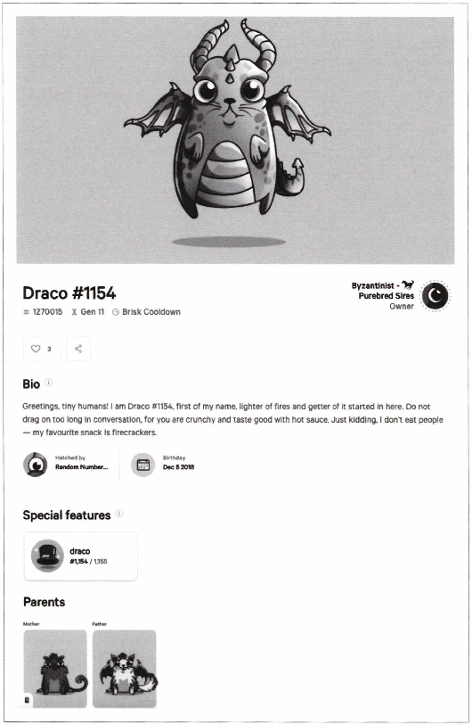

# 5장. 모든 것을 토큰화

- 비트코인의 등장: 다양한 암호화폐를 탐험할 수 있는 기회가 생겼다.
- 이더리움의 등장: 블록체인 위에 새로운 암호화폐인 토큰을 쉽게 만들 수 있는 능력을 얻었다.

## 이더리움 플랫폼의 토큰

---

- 개발자는 이더리움 네트워크에 암호화폐를 만들 수 있다.
- ERC-20 표준: 네트워크 상의 블록체인 자산에 대한 참조 구현체
    - 거래소, 지갑, 기타 서비스에서 쉽게 구축될 수 있는 속성을 제공한다.
    - 오늘날 가장 쉽고 안전한 암호화폐를 만드는 방법 중 하나다.
- 토큰은 기술적인 프로젝트 외에도, 기존 금융 서비스에 혁명을 일으킬 잠재력이 있다.
    - 부동산 거래 등 자산 이전을 빠르고 쉽게 처리하거나, 미술, 자동차, 주식, 채권 등의 분야에서 진정성을 증명하는 데 유용하다.

### 대체 가능한 토큰과 대체 불가능한 토큰

---

- 토큰의 주요 차별화 요소: 대체 가능 여부
- 대체 가능한 토큰: 모두 같은 가치를 가지고 교환 가능하다.
    - ex> 미국 달러나 비트코인, 이더리움, ERC-20 등
- 대체 불가능한 토큰(NFT): 각 토큰이 독특하며 교환 불가능하다.
    - ex> 크립토키티(CryptoKitties)가 있다.
- 이더리움은 다양한 토큰 유형을 제공한다.
    - 대표적 유형: ERC-20, ERC-721, ERC-223, ERC-777, ERC-1400

### 토큰이 필요한 이유

---

- 개발자가 블록체인 기반 솔루션을 개발할 때 '토큰이 필요한가?'를 질문해야 한다.
- ICO는 암호화폐를 통한 자금 모금의 좋은 방법이지만, 규제 압력으로 인해 더 큰 기능을 가진 토큰을 만들도록 요구받고 있다.
- 토큰은 스테이블코인처럼 안정적 자산 가치를 추구하는 프로젝트에는 적합하지 않을 수 있다.
- 블록체인에서 거래 수수료는 큰 문제이며, 높은 수수료를 지불할 의사가 있는 사람이 우선순위를 얻는 형태로 이루어진다.

### 에어드롭

---

- ICO 외에도 이미 존재하는 블록체인 네트워크 효과를 활용한 에어드롭이 있다.
- 암호화폐를 무료로 주거나 저비용으로 배포하여 사용자 기반을 신속히 확보할 수 있다.
- 대표적인 사례는 Blockchain.info 지갑의 스텔라 재단이 XLM 토큰을 뿌린 사례가 있다.

### 다른 토큰 종류

---

- 유틸리티: 암호화폐가 금융 거래 외의 사용과 교환의 가치를 제공. ex> 파일코인(Filecoin)
- 보안(증권형 토큰): SEC가 정의한 투자계약. 수익의 약속을 제공하도록 설계된 토큰. ex> 블록스루트

## 이더리움 코멘트 요청(ERC) 이해

---

- ERC는 이더리움 커뮤니티가 공식 표준을 만들기 위해 시작한 것이다.
- ERC 표준은 EIP(Ethereum Improvement Proposal)를 통해 심사와 검증을 거친다.

### ERC-20

---

- 가장 일반적인 ERC 표준. 스마트 컨트랙트는 반드시 다음 메서드를 구현해야 한다:
    - `totalSupply`: 총 토큰 공급량 조회
    - `balanceOf`: 계정의 잔액 조회
    - `transfer`: 토큰 전송
    - `transferFrom`: 다른 주소에서 토큰 전송
    - `approve`: 최대 인출 허용량 설정
    - `allowance`: 허용된 인출량 조회
- ERC-20 이벤트:
    - `Transfer`: 토큰 전송 시 이벤트 발생
    - `Approval`: 인출 승인 시 이벤트 발생

### ERC-721

---

- 대체 불가능한 토큰(NFT)의 표준. 각 토큰이 고유하며 복사 불가능한 디지털 희소성을 제공한다.
- 크립토키티와 같은 디지털 자산에 사용된다.
    
    
    
    그림 5-1. 고유 ID 1270015를 가진 크립토키티의 고유 속성
    

### ERC-777

---

- (ERC-20을 개선한) 차세대 대체 가능한 토큰 표준.
- `authorizeOperator`, `revokeOperator` 함수 추가
- `tokensReceived`, `tokensToSend` 후크 포함하여 트랜잭션 안전성 높임
- `send(address to, uint256 amount, bytes data)` 함수로 데이터 전달 가능

### ERC-1155

---

- 게임 내 상품 추적하도록 설계된 표준.
- ERC-20과 ERC-721 속성 혼합
    - ERC-20(대체 가능)을 통해 가상재화에 가격을 붙일 수 있으며, 이후 해당 아이템을 거래할 수 있다.
    - ERC-721(대체 불가능)은 가상재화가 고유한 특성을 가질 수 있도록 한다.
        - ex> 얼마나 많은 로켓을 보유할 수 있는지, 무기가 얼마나 강력한지 등
- 한 트랜잭션에서 여러 토큰(`_ids`) 전송 가능(`safeBatchTransferFrom`)
    - ERC-721: 토큰을 전송할 때 함수 `safeTransferFrom`을 호출하고 전송할 토큰을 지정(`_tokenld`)한다.

## 다중 서명 콘트랙트

---

- 자금 전송 시 여러 서명을 요구하여 무단 자금 전송 방지.
- M/N 다중 서명 개념(M<N, 트랜잭션 완료에 필요한 최소 서명 수)
    - N: 트랜잭션을 승인할 수 있는 이더리움 주소의 수
    - M: 트랜잭션을 승인하는 데 필요한 N개의 고유 주소 중 최소 서명 수
- ICO에서는 보통 다중 서명 지갑을 사용하여 투명성 및 신뢰성 높인다.

## 탈중앙화 거래소 콘트랙트

---

- 중앙 집중식 거래소(코인베이스 등)의 단점 해결.
- 거래소의 목적: 두 당사자가 암호화폐를 안전하게 교환할 수 있는 신뢰할 수 있는 플랫폼 역할을 하는 것
    - 교환이 취해야할 조치
        - 안전한 암호 입출금 장소를 제공하고 자금을 에스크로에 보관한다.
        - 암호화폐 거래 가격을 합의할 수 있도록 오더북을 제출한다.
        - 양 당사자 간에 암호화폐를 교환한다.
- 스마트 컨트랙트 기능
    - ETH 및 ERC-20 토큰을 발신/수신, 보관한다.
    - EOA 계정의 가격 요청을 기록한다.
    - 두 가지 가격 요청이 일치할 경우 해당 암호화폐의 소유권을 변경한다.

- 이더리움 탈중앙화 거래소: IDEX
    
    
    
    그림 5-4. 집중화 거래소과 탈중앙화 탈중앙화 거래소의 장점은 다음과 같다.
    
    - 장점: 투명성 향상, 대응 위험 감소
    - 단점: 느린 속도, 비싼 가격, 일반 사용자에게 어려움 (매번 트랜잭션 서명 필요)

❗온라인으로 모든 ERC 표준을 볼 수 있고 오픈제플린(OpenZeppelin)은 ERC를 준수하는 스마트 콘트랙트의 훌륭한 라이브러리를 제공한다.

## 요약

---

- 이더리움은 오늘날 토큰화를 위한 가장 큰 블록체인이다.
    - 다양한 ERC 표준이 많은 옵션을 제공한다.
- 이더리움을 기반으로 수많은 혁신적인 블록체인 기반 애플리케이션을 만들 수 있다.
    - 기술이 계속 성숙함에 따라 더 많은 애플리케이션이 탄생할 것이다.
