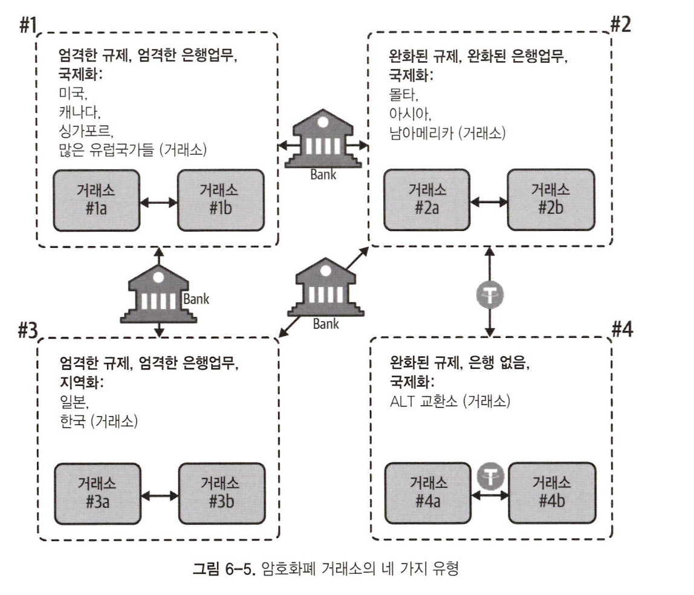
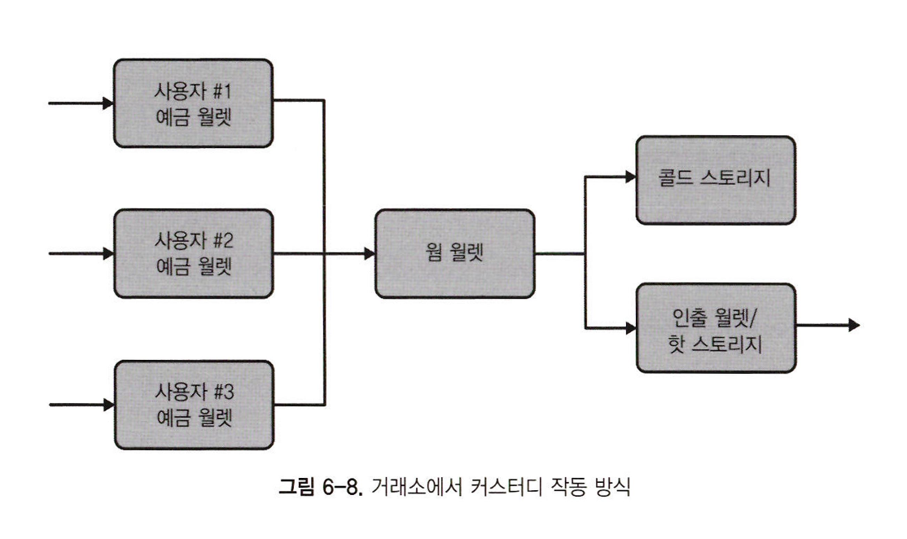

# 마켓 인프라

암호화폐 역사 전반에 걸쳐 사고 파는 방법은 다음과 같다.

- 사람 대 사람: 암호화폐를 사고 파는 것은 대면 거래로 이뤄진다.
- 제품/서비스 구매 또는 판매: 사람들은 암호화폐를 얻거나 무언가의 대가로 소비한다.
- 암호화폐 ATM: 키오스크는 암호화폐를 현금으로 분배한다. 또한 현금을 암호화폐로 바꿀 수 있다.
- 채굴: 마이너들은 컴퓨팅 파워를 사용해 네트워크에 기여함으로써, 새로운 블록을 채굴하고 트랜잭션 수수료를 받는다.
- 거래소: 암호화폐는 주식 거래소와 비슷한 양상으로 특정 웹사이트에서 거래가 이뤄지지만 미묘한 차이가 있다.

## 거래소의 역할

암호화폐 거래소는 암호화폐 시장에서 지배적인 역할이 됐다.  
아래는 거래소의 기본 유형이다.

- 중앙 집중화 거래소: 통상적으로 %형태로 거래 수수료를 징수하는 회사에서 운영된다.
- 탈중앙화 거래소: 기업이 운영하는 것이 아니라 스마트 콘트랙트로 오더북을 운영하는 사이트다.
- 현물 거래소: 거래자가 자산을 소유하며, 중앙집중식 거래소의 경우 일반적으로 거래자의 계정에 자산을 보유한다. 탈중앙화 거래소의 경우 자산은 자체 보관된다.
- 파생상품 거래소: 트레이더들이 높은 레버리지 제품, 옵션, 스왑, 선물 등 복잡한 거래 도구를 사용할 수 있도록 해주는 회사다.

 

암호화폐 거래소는 주식 거래와 비슷한 기본 주문 유형을 갖고있다.

- 마켓: 현재 시장가격으로 즉시 거래를 실행하는 주문이다.
- 제한: 가격이 지정된 주문이다. 마켓이 매수나 매도 가격에 맞춰질때까지 주문되지 않는다.
- 만기: 만기 주문을 통해 일부 거래소는 만기일을 설정할 수 있다. 보통 일, 주, 월 또는 취소할때까지와 같은 매개변수가 사용된다.
- 메이커/테이커: 유동성을 제공하는 트레이더(메이커)가 수수료를 지불하지 않는 반면, 마켓에서 오더북을 통해 거래하는 거래자(테이커)가 거래소에서 수수료를 지불한다는것을 의미한다.
- 매수: 매수란 구매자가 마켓 주문에 지불할 수 있는 희망매수 가격이다.
- 매도: 매도란 판매자가 마켓 주문을 받아들이는 희망매도 가격이다.

### 오더북

오더북은 거래소의 미결제 암호화폐 주문을 시각적으로 표현한 것이다.  
거래자가 체결될 수 있는 매수, 매도 주문을 확인할 수 있도록 한다.

### 슬리피지

거래의 예상 가격과 체결 가격 간의 차이인 슬리피지는 암호화폐 거래의 주요 쟁점이다.  
대부분의 거래소에서 주문이 적어 주문서가 얇은 상태이므로 큰 규모의 주문은 이상적인 가격보다 낮은 가격으로 슬립한다.  
트레이더들은 주문을 작은 단위로 분할하거나 장외거래(OTC) 시장에 진출해 같은 가격에 판매할 수 있다.

### 뎁스차트

오더북 시각화 도구인 뎁스차트를 통해 트레이더는 특정 암호화폐에 대한 매수/매도 깊이를 확인할 수 있다.  
이를 통해 시장에서 수요와 공급 사이의 실시간 관계를 볼 수 있다.

### 관할권

전통적인 금융 부문의 자산 대부분은 규제가 높은 중앙집중화 거래소에서 거래된다.  
반면 암호화폐 거래는 수백개의 거래소, 수천개의 시장에서 이뤄진다.  
암호화폐는 다른 관할권에서 운영되므로 다양한 수준의 규제 감독을 준수해야 한다.

 

암호화폐 거래소는 운영하는 관할권의 법에 의해 구속된다. 이는 교환이 다음 4가지 유형에 속함을 보여준다.

1. 엄격한 규제를 받는 국제 거래소에 해당한다. 은행업무를 유지하기 위해 고객 규칙을 엄격히 하고 고객 정보를 파악한다.
2. 완화된 규제를 두고 운영하는 거래소에 해당한다. 미국 이외의 지역에서 국제 고객에게 은행 및 서비스를 제공하기 위해 규칙을 완화해 고객 정보를 덜 요구하는 것을 의미한다.
3. 규제가 심한 지역화된 거래소에 해당한다. 은행 업무에 대한 고객 규칙을 엄격하게 하고, 해당 나라에 있는 고객들에게만 서비스를 제공한다.
4. 은행이 없어서 규제가 완화된 거래소에 해당한다. 은행 계좌를 유지하기 위한 규정을 준수하지 않는다.

처음 세 유형의 거래소는 은행 계좌를 제공하기 때문에 전통적인 은행 네트워크를 통해 하나의 마켓에서 자산을 구입하고  
다른 시장에서 동일한 자산을 더 높은 가격에 판매하는 것과 같은 차익 거래가 가능하다.

### 자금세탁

암호화폐 시장에서 자금세탁은 다음 중 하나의 목적을 이루기위해 악의적인 행위자들에 의해 시행된다.

- 암호화폐 거래량을 늘려 가격을 끌어올린다. (스푸핑)
- 특정 암호화폐의 대량 판매 등으로 악행을 감추고 활동한다.
- 거래량을 부풀려 거래소가 받는 거래 수수료를 올린다.

## 암호화폐 시장 구조

암호화폐 시장은 시장 깊이나 대량 주문을 흡수하는 능력이 부족하다.  
다른 시장에 비해 거래자 수가 적고, 규제 문제가 fiat 통화와의 거래를 어렵게 만들기 때문이다.

### 차익 거래

차익 거래는 마켓에서 자산을 특정 가격에 매입하고 다른 마켓에서 같은 자산을 더 높은 가격에 매도하는 행위이며, 마켓 간의 가격 차이를 이용한다.  
차익 거래업자들은 무역 공동체에서 가격 차이를 없애고 유동성을 증가시켜 생태계를 덜 불안정하게 만든다. 

### 거래처 리스크

차익 거래는 하나 이상의 거래소에 많은 자본을 남길 필요가 있다.  
차익 거래에서 가장 큰 위험성 중 하나는 자금을 보관하는 거래소에 자본을 맡기는 것이다.  
해킹으로부터 강력하고 안전한 거래소 커스터디 인프라를 구축하려면 다음이 필요하다.

- 많은 기술 자원
- 여러 보안 그룹에 의한 감사
- 명확하게 정의되고 신중하게 계획된 기업 지배 구조 프로세스

거래소 사용자는 계좌에 입금하고 싶을때 입금 주소로 송금한다.  
거래소는 각 사용자에게 별도의 입금 주소를 부여한다. 이를 통해 자금이 들어올때 어떤 사용자에게 자금을 입금해야 하는지 알 수 있다.  
자금이 입금되면 자동으로 웜 월렛으로 흘러 들어 화이트리스트에 기재된 주소 또는 미리 정해진 주소로만 자금을 보낼 수 있다.  
웜 월렛은 수신 자금을 핫 월렛 또는 콜드 월렛으로 분배한다. 거래소는 인출 지갑에 더 많은 자금을 보충해야 한다.

콜드 스토리지는 암호화폐 보유 자산과 개인 키를 오프라인으로 저장하는 것을 의미한다.  
자금을 전송하기 위해 서명을 하는 과정도 오프라인에서 콜드 스토리지에 있는 개인키와 함께 이뤄진다.  
서명이 생성되면 인터넷에 연결된 기계에 수동으로 입력돼 트랜잭션 요청을 블록체인 네트워크로 브로드캐스트한다.

> 거래소는 보통 고객 자금의 95% 이상을 콜드 스토리지에 보관하고 5% 미만의 자금을 핫 스토리지에 보관한다.  
> 이렇게 하면 해커가 거래소를 침해할때 핫 스토리지에 저장된 자금만 빼내면 된다.  

#### 화이트리스트 주소

또한 거래소는 들어오는 모든 지갑을 핫 월렛에만 자금을 보낼 수 있도록 구성해야 한다.

#### 유동성의 징후

사용자들이 자금을 인출할때 시간이 오래 걸리는것은 거래소가 곤경에 처해 폐쇄될 가능성이 있다는 신호일 수 있다.  
고객의 인출 요청에 대한 응대가 늦어지는 것은 거래소가 유동성이 부족하고, 사용자 자금에 대한 유동성이 없어졌다는 증상이다.

### 마켓 데이터

오늘날 시장 정보에 대해 일반적인 데이터를 제공하는 출처는 다음과 같다.

- 코인데스크
- 스큐
- 글래스노드
- 트레이딩뷰

#### 블록 익스플로러

사용자는 블록 익스플로러를 통해 체인의 각 블록의 내용을 조사해 모든 블록체인 트랜잭션을 볼 수 있다.  
txid로 블록체인에서 최근 또는 과거 트랜잭션의 세부 정보를 검색하고 특정 주소에서 수행한 모든 트랜잭션을 볼 수 있다.  
또한 주소를 다른 트랜잭션에 연결해서, 한 주소를 보면 다른 주소로 만든 트랜잭션을 볼 수 있다.

#### 트랜잭션 흐름

블록체인에서 트랜잭션 흐름을 추적하는 기능은 거래 패턴을 분석하는데 도움이 된다.  
암호화폐의 움직임을 추적하는 것은 fiat 통화를 추적하는 것보다 훨씬 쉽다.

## 규제 문제

규제를 준수하는 거래소는 거래소를 운영 국가의 법을 따른다.  
가령 전 세계 거래소 대부분은 다른 나라에 거주하는 고객에게 서비스를 제공하지만, 한국 거래소는 한국에 거주하는 고객에 한해 서비스를 제공할 수 있다.  
한국 정보는 외국인들에게 서비스를 제공하는 거래소를 정지했다. 게다가 출국할 수 있는 자금의 양을 제한하는 자본 통제권이 있다.

### 뱅킹 리스크

fiat이 포함된 차익거래를 할때는 은행 계좌가 필요하며, 거래소간 자금 이동을 위해 사용된다.  
국제적으로 규제당국과 은행들이 더 엄격한 AML과 KYC 규칙을 부과하는 추세가 있다.

