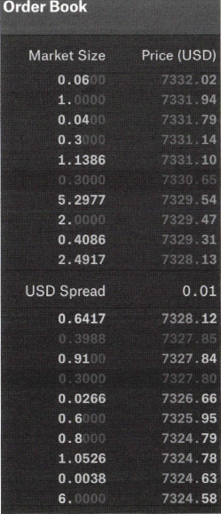

# 6장. 마켓 인프라

- 암호화폐 시장
    - 전 세계 다양한 시장에서 공개적으로 거래 중
    - 거래의 60~80%는 투기성으로 추정됨
    - 초기에는 인프라 부족으로 시장 불안정성이 높았으며, 현재도 완벽하지 않음
    - 규제가 완전히 정립되지 않아 위험성이 존재함

## 비트코인의 가격 변동

---

- 비트코인은 전체 암호화폐 시장의 지표 역할을 함.
- 주요 가격 상승 사례:
    - 2010년: 0.008달러 → 0.08달러(90% 상승)
    - 2010년 11월: 0.50달러(525% 상승)
    - 2011년 6월: 31.91달러(6,282% 상승)
    - 2013년 3월: 266달러(734% 상승)
    - 2013년 12월: 1,154.93달러(334% 상승)
    - 2017년 12월: 17,900달러(1,450% 상승)

- 암호화폐 거래 방식
    - 개인 간 거래, 제품·서비스 구매나 판매, 암호화폐 ATM, 채굴, 거래소를 통한 거래 등 다양한 방식 존재
    - 코인 ATM은 편리하지만 수수료가 비싸고 전통적 ATM처럼 쉽지 않음
    - 채굴은 현재 엔터프라이즈 데이터센터 중심으로 전환

## 거래소의 역할

---

- 시장에서 지배적인 역할
- 거래소 유형
    - 중앙집중화 거래소: 퍼센트(%) 단위로 거래 수수료 징수
    - 탈중앙화 거래소: 스마트 계약 기반의 암호화폐 전용
    - 현물 거래소: 거래소가 자산을 직접 보관하거나 개인 계정에 보관
    - 파생상품 거래소: 높은 레버리지 제공
- 주요 거래 용어
    - 마켓 주문: 즉시 시장 가격으로 거래
    - 제한 주문: 지정 가격 거래
    - 만기 주문: 특정 날짜나 조건까지 유지되는 주문
    - 메이커/테이커 모델: 유동성 제공자는 수수료 없음(메이커), 이용자는 수수료 지불(테이커)
    - 매수(Bid)/매도(Ask): 시장에서 원하는 거래 가격
    

### 오더북

---

- 오더북: 미체결 주문 시각화
    
    
    
    그림 6-2. 일반적인 오더북
    

### 슬리피지

---

- 슬리피지(Slippage): 주문량이 크거나 오더북이 얇을 때 발생하는 불리한 가격 변동
    
    
    
    그림 6-3. Coinbase Pro의 오더북에서 보여주는 슬리피지
    
    - 판매량은 매입액보다 훨씬 많다.

### 뎁스차트

---

- 시장의 수요와 공급 실시간 관계 시각화
- 특정 암호화폐에 대한 매수·매도 깊이를 확인하는 데 사용
    
    
    
    그림 6-4. 뎁스차트
    

### 관할권

---

- 암호화폐 거래소는 관할권에 따라 크게 4가지 유형 존재
    1. 엄격 규제 국제 거래소(미국, 캐나다, 싱가포르, 유럽)
    2. 완화된 규제의 지역 거래소(아시아, 남미)
    3. 규제가 심한 지역화된 거래소(한국, 일본)
    4. 은행이 없고 규제가 가장 완화된 거래소(아시아, 남미)
    
    
    
    그림 6-5. 암호화폐 거래소의 네 가지 유형
    
- 규제 차이로 인해 차익거래 가능하며, 이를 안정화하기 위해 USDT(테더) 같은 스테이블코인 활용

### 자금세탁

---

- 자금세탁: 가격 인위적 조정으로 불법 행위
- 스푸핑(암호화폐 거래량을 늘려 가격을 끌어올림), 덤핑(암호화폐의 대량 판매), 거래량 부풀리기 등 시장 조작 가능

### 고래

---

- 고래(헤비 트레이더): 시장에 예측 불가능한 영향을 미치며 가격을 조정하는 힘을 지님
    - 기관 투자자와 달리 개인 자산 및 컴퓨터로도 운용 가능


그림 6-7. 비트코인 시장에 미치는 영향

### 파생상품

---

- 옵션: 가격 상승(콜 옵션)이나 하락(풋 옵션) 시 이익을 얻는 권리를 부여하지만 의무는 없음. 암호화폐 옵션 거래는 규제로 인해 초기 단계
- 선물: 미래 특정 가격에 암호화폐 거래를 확정하는 계약으로 가격 변동성 리스크 관리에 사용됨. 대표 거래소는 CME, Bakkt 등
- 상장지수펀드(ETF): 암호화폐를 기반으로 하는 지수 펀드로 미국에선 아직 승인되지 않음
    
    → 2024년 1월 10일, 미국 증권거래위원회(SEC)는 비트코인 현물 ETF(Spot Bitcoin ETF)를 승인했다.
    
- 마진/레버리지 상품: 자금을 빌려 거래하며, 최대 100배의 레버리지를 제공하지만 손실 위험도 큼

## 암호화폐 시장 구조

---

- 암호화폐 시장은 시장 깊이나 대량 주문 흡수 능력에 한계가 있음
    - 상대적으로 거래자 수가 적다.
    - 규제 문제가 피아트(법정)통화와의 거래를 어렵게 만든다.

### 차익 거래

---

- 마켓에서 자산을 특정 가격에 매입하고 다른 마켓에서 같은 자산을 더 높은 가격에 매도하는 행위
    - 마켓 간 가격 차이를 이용한 거래
    - 유동성을 높이고 가격 변동성을 낮춘다.

### 거래처 리스크

---

- 그러나 거래소에 자본을 보관하는 리스크가 존재한다.
    - '키가 없으면 코인도 없다'

- 거래소 커스터디 및 보안
    - 해킹으로부터 강력하고 안전한 거래소 인프라 구축 요소
        - 많은 기술 자원
        - 여러 보안 그룹에 의한 감사
        - 명확하게 정의되고 신중하게 계획된 기업 지배 구조 프로세스
        
        
        
        그림 6-8. 거래소에서 커스터디 작동 방식
        
    - 거래소는 고객 자금(95% 이상)을 콜드 스토리지에 보관하고, 5% 미만을 핫 스토리지에 보관한다.
    - 화이트리스트 주소로 핫 월렛 출금을 제한하여 보안을 강화한다.
    - 유동성 징후: 인출이 지연되는 경우 거래소의 유동성 위기 신호일 수 있다.

### 마켓 데이터

---

- 정확한 데이터 제공처: 코인데스크, 스큐, 글래스노드, 트레이딩뷰 등
- 블록 익스플로러: 트랜잭션 흐름을 시각화하고 주소 및 거래 추적에 사용된다.
- 트랜잭션 흐름 추적: 그래프센스, Whale Alert 등

## 분석

---

- 암호화폐 시장에서 트레이더가 돈을 벌기 위해 사용하는 시장 분석 방법
    - 기술적 분석
    - 기본적 분석

### 기본적 암호화폐 분석

---

- 경제적, 재정적 요인을 조사해 암호화폐 가치를 측정

- 튤립 파동인가 인터넷인가?
    - 암호화폐가 튤립 파동과 유사한 투기적 거품인지, 아니면 인터넷처럼 장기적 혁신을 가져올지 논쟁이 있음
    - 닷컴 버블 사례를 들며 과도한 투자의 위험성을 지적함
- 기본 분석 도구
    - 일부 매체는 편향된 기사(페이 투 플레이)를 작성하여 암호화폐 시장에 영향을 미친다.

### 기술적 암호화폐 분석

---

- 차트 중심의 분석으로, 과거 기록을 통해 미래 가격 예측
- 근본적 분석 자료는 부족하기 때문에 기술적 분석 활용이 많음
- 일부는 근본적 분석 없이 차트만으로 거래 결정

- 기술 분석 차트
    - 트레이딩뷰 등 차트 도구 사용
    - 이동 평균, 볼륨 표시, 오실레이터 등 다양한 보조지표 포함
- 바트 패턴
    - 암호화폐에 독특한 패턴. 급락 → 횡보 → 급등 → 횡보 → 하락 순으로 이어짐
        
        
        
        그림 6-12. 유명한 바트 패턴
        
    - 시장의 깊이와 유동성이 낮은 '얇은 시장'에서 자주 발생한다.

## 차익 거래

---

- 두 개 이상의 시장에서 자산을 싸게 사고 비싸게 파는 방식

- 기본적 차익 거래
    - 코인베이스에서 BTC를 10,000달러에 매수 → 제미니에서 10,100달러에 매도
    
    → 100달러 차익
    
- 삼각 차익 거래
    - USD → BTC (10,000달러)
    - BTC → 70 ETH
    - ETH → 10,200달러
    
    → 200달러 차익 발생
    

### 타이밍 및 플로트 관리

---

- 플로트: 거래소 간 송금 또는 예치된 자금
- 빠른 타이밍이 중요. 가격 변동, 기회 상실 방지 위해 미리 준비 필요하다.

### 플로트 구성1

---

- 각 거래소에 자금(BTC, USD)을 미리 배치한다.
- 거래 기회 발생 시 즉시 매수·매도한다.

### 플로트 구성2

---

- 자금은 한쪽에만 배치한다.
- 기회 발생 시 송금이 필요하다. 리스크 존재 (ex> BTC 전송 중 가격 변동)

### 플로트 구성3

---

- 삼각 거래 방식
    - USD → BTC → ETH → USD 순으로 회전

## 규제 문제

---

- 거래소는 해당 국가 법에 따라 운영된다.
- 한국은 외국인에 대한 서비스 제한 사례가 있다.
- 거래소마다 프리미엄(김치 프리미엄) 존재할 수 있다.

### 뱅킹 리스크

---

- 차익 거래에는 은행 계좌가 필요하다.
- 은행은 KYC, 자금세탁방지 규정에 따라 신중하게 계좌 개설해야 한다.
- 암호화폐 산업 특성상 거래소가 계좌 개설에 어려움 겪는 경우가 있다.

### 거래소 리스크

---

- 신뢰성 문제
    - 거래소 API 버그
    - 거래 우선순위를 매기기 위해 거래 봇을 실행하는 규제되지 않은 거래소
    - 환율제한을 도입하는 거래소에서 차익 거래 API 호출 제한
    - 거래소 서버에서 접속 문제가 발생해 API 호출 지연

### 기본적인 실수

---

- 기본적인 재정 거래 실수
    - 거래 수수료와 세금을 차익 거래 계산에 포함시키지 않는 경우
    - 차익 거래 기회를 계산할 때 시세 가격만 보는 경우

## 거래소 API 및 트레이딩봇

---

- 트레이딩봇 성능은 거래소 API 품질에 의존한다.
- 고품질 API 특징
    - 고속 네트워크 접속을 갖춘 강력한 서버에서 실행
    - API 호출은 다양한 트레이딩 전략을 수용하도록 설계
    - REST 및 웹 소켓 지원
    - 높은 속도 제한
    - OAuth2 또는 해시 계산을 사용하는 HMAC 같은 산업 표준 보안 계획을 따름
    - 문서화
    - 테스트/스테이징 환경을 제공
    - 여러 코딩 플랫폼에 라이브러리를 제공
    - 플랫폼의 실시간 커뮤니케이션과 사고 관리의 투명성

- ex> 거래소 API
    - Coinbase Pro - BTC/USD
        
        ```powershell
        GET https://api.pro.coinbase.com/products/BTC-USD
        ```
        
        - 상세 정보 제공: 가격, 최소 단위, 상태 등 포함
            
            ```json
            {
              "id": "BTC-USD",
              "base_currency": "BTC",
              "quote_currency": "USD",
              "base_min_size": "0.00100000",
              "base_max_size": "280.00000000",
              "quote_increment": "0.01000000",
              "base_increment": "0.00000001",
              "display_name": "BTC/USD",
              "min_market_funds": "5",
              "max_market_funds": "100000",
              "margin_enabled": false,
              "post_only": false,
              "limit_only": false,
              "cancel_only": false,
              "trading_disabled": false,
              "status": "online",
              "status_message": ""
            }
            ```
            
    - Gemini - BTC/USD
        
        ```powershell
        GET https://api.gemini.com/v2/ticker/btcusd
        ```
        
        - 가격 데이터 위주 제공: 시가, 고가, 저가, 종가, bid/ask 포함
            
            ```json
            {
              "symbol": "BTCUSD",
              "open": "9179.77",
              "high": "9298",
              "low": "9050",
              "close": "9195",
              "changes": [
                "9219.54",
                "9211",
                "9211.71",
                "9243.67",
                "9243.71",
                "9250",
                "9249.03",
                "9235.41",
                "9237.69",
                "9244.22",
                "9244.68",
                "9240.38",
                "9248",
                "9263.61",
                "9289.8",
                "9291.62",
                "9269.68",
                "9222.01",
                "9210.09",
                "9160.63",
                "9165.4",
                "9152.46",
                "9164.7",
                "9173.33"
              ],
              "bid": "9195.00",
              "ask": "9195.01"
            }
            ```
            

→

- 제미니는 과거 가격 제공, API 품질 낮음
- 거래소마다 API 품질 격차 큼: 많은 시간·노력 필요
- 봇 동작 시 API 요청 속도, 처리량 등 주의

### 오픈소스 트레이딩 기술

---

- 오픈소스 라이브러리 사용 시 구현 용이
- 대표 라이브러리: CCXT
    - 125개 이상 거래소와 통합 가능
    - 공통 인터페이스 제공

- 중요한 API 호출
    - 공개 호출
        - 티커 가격 검색
        - 오더북 데이터 검색
    - 비공개 호출
        - 계정 거래 내역 검색
        - 거래 계좌 간 자금이체
        - 주문 작성, 실행 및 취소

### 속도 제한

---

- 외부 요청 제한 있음 (ex> 초당 3~5회)
- 과도한 요청 시 429 에러 발생
- DDoS 보호 목적

### REST 통신과 웹 소켓 통신

---

- REST: 주기적 요청 필요
- WebSocket: 실시간 푸시 → 효율적
- 고속 시장 반응을 위해 WebSocket 사용 권장

### 샌드박스에서의 테스트

---

- 샌드박스 환경에서 가상 자금 테스트 권장
- 일부 거래소는 샌드박스 미제공 → 실거래 위험 있음

### 마켓 에그리게이터

---

- 코인마켓캡, 코인게코는 여러 거래소 가격 API 제공
    - 장점: 시장 전체 파악 용이
    - 단점: 잘못된 데이터 전송 가능성 있음

## 요약

---

- 암호화폐 시장은 아직 규제 구조가 완전히 정립되지 않았음
- 많은 기회, 암호화폐 가격만이 유일한 동기 부여 요소로 작용하고 있다.
- 암호화폐 시장은 빠르게 변화하고 있다.
