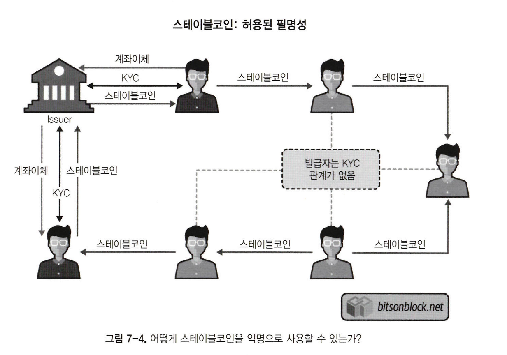
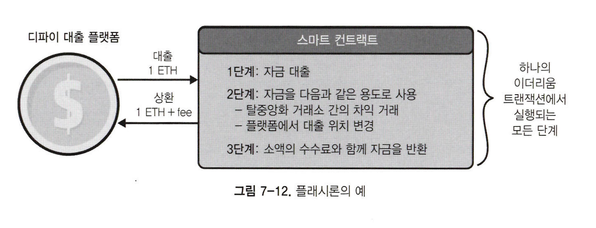

# 탈중앙화된 금융과 웹

## 신탁 재분배

암호화폐를 사용하는 결제 계층은 블록체인으로 중개자없이 거래할 수 있다.  
시간이 지남에 따라 회사가 아닌 개인이 데이터를 소유할 수 있게 된다.

### 해킹의 정체성과 위험성

사용자가 데이터 소유권을 갖는 것이 중요한 이유는, 금융 분야 대기업들은 반복적으로 침입, 해킹 등으로 피해를 입어 데이터 관리자의 역할을 하지 못하고 있다.  
블록체인 기술은 다양하고 많은 산업들을 빠르게 중개할 수 있는 능력이 있다는 점에서 유먕하다.  
블록체인 도입을 위한 실험은 이미 시작되었고, 오늘날 사용자가 데이터를 효과적으로 제어할 수 있도록 기술적 스캐폴딩이 구축 중이다.

### 지갑

메타마스크는 크롬, 파이어폭스, 오페라 브라우저에서 작동하는 소프트웨어 지갑이다.  
레저와 같은 하드웨어 지갑은 대안으로 사용할 수 있으며, 키 저장에 관심이 없는 사용자들을 위해 지갑을 보관해주는 코인베이스같은 서비스를 이용할 수도 있다.

> 키를 소유하지 않는 것은 자산을 소유하지 않는 것과 같다.

### 개인키

메타마스크와 레저 지갑은 사용자가 개인키를 알고 신중하게 저장해야 한다.  
패스워드 또는 니모닉이 손실되면 개인키를 잃어버린 것과 같다. 따라서 개인키를 보관하면서 ID를 유지할 수 있는 서비스가 필요하고, 코인베이스는 이에 관해 조치를 취하고 있다.  
키베이스, 블록스택같은 식별 서비스는 사용자들이 웹 3.0의 다양한 유형에 대해 개인키를 유지하기 쉽게 해준다.

 

## 탈중앙화 금융

디파이 서비스는 스마트 콘트랙트, 암호화폐, 블록체인을 활용해 은행권이 전통적으로 제공해온 일부 서비스를 대체한다.  
디파이는 여러 구성요소로 이뤄져 있으며, 그중 상당수가 이더리움과 ERC-20 자산에 의존한다.  
디파이는 이더리움에서 ERC-20의 유연성을 통해 가능한 것인데, 이는 시장 상황에 따라 풀을 확장하거나 줄일 수 있기 때문이다.

### 중요한 정의

스마트 콘트랙트는 디파이 모델에 필수다. 많은 암호화폐는 유통되는 자산의 고정 공급이 존재하기 때문에 가치가 있다.  
단, 많은 디파이 토큰은 시스템의 디자인에 따라 인플레이션, 디플레이션을 발생시키는 탄력적인 공급장치를 갖고 있다.

#### 민팅

민팅은 암호화폐 공급을 늘리기 위해 사용되며, 새 자산을 만드는 기능을 포함한다.  
민팅은 보상을 받으려는 초기 투자자나 인센티브용으로 자산을 모으는 사용자를 위해 새 블록을 생성해 수행된다.  
거버넌스 시스템을 통해 인플레이션을 제한하기 위해 민팅은 적절하게 통제돼야 한다.

#### 소각

암호화폐 공급을 줄이기 위해 코인 소각을 사용하는데, 이때 자산의 소멸이 수반된다.  
소각은 유통량을 줄이고 공급을 줄임으로써 가상화폐 가격을 상승시킨다.

#### 랩드토큰

이더리움 플랫폰은 ERC-20 표준을 염두에 두고 설계된 것이 아니다.  
스마트 콘트랙트로 ERC-20과 다양한 암호화폐를 거래하려는 사용자들로 인해 **랩드토큰**이 해결책이 됐다.  
원래 자산은 포장되는 형태(담보)로써 온체인에서 보유할 수 있다.  
스마트 콘트랙트로 ERC-20 대표자들의 외부 암호화폐 담당자들을 위해 예금(민팅)과 인출(소각) 과정이 쉬워진다.

#### DAO

탈중앙화 자치 단체(DAO)는 주로 이더리움 스마트 콘트랙트를 통해 조직된 프로젝트다.  
DAO는 블록체인 기반 스마트 콘트랙트를 활용하기 때문에 트랜잭션에 대한 투명한 기록과 DAO를 조정하는 규칙이 있다.

#### 오라클

블록체인은 관계형 데이터베이스같은 데이터 소스와의 인터페이스가 없어서, 오라클은 외부에 정보를 제공하기 위해 필요하다.  
중앙집중식 데이터베이스에 기록된 이벤트나 데이터를 블록체인으로 가져오는 역할이 필요하며, 오라클이 그 목적을 달성한다.

### 스테이블 코인

미국 달러화 및 fiat 통화에 부합하는 블록체인 기반 자산으로, 은행 중개인이 필요없는 서비스를 뒷받침한다. 

#### DAI

변덕스러운 암호화폐 세계에서 디파이는 사용자에게 적절하게 서비스하려면 안정적인 자산이 필요하다.  
오늘날 사용되는 주요 스테이블코인 암호화폐는 메이커 프로젝트의 DAI다.  
스테이블코인인 DAI를 뒷받침하는 암호화폐는 본질적으로 변동성이 큰데, 자산을 잠그는 방식으로 이를 제어한다.  
다음은 메이커 프로젝트가 작동하는 방식이다.

1. 사용자는 Vault에 자산을 과잉 담보로 예치하고 DAI를 발행
2. 안정 수수료와 DSR(DAI 보유자에게 연이율 형태로 이자를 지급하는 풀. DSR을 높이면 DAI 보유를 유도해 유통량을 줄이고, 가격 하락 압력을 방어)을 통해 수요·공급을 조절
3. 청산 메커니즘으로 과도한 부실을 방지

#### USDC

ERC-20 스테이블코인인 USDC는 코인베이스와 서클이 만들었다.  
그랜드 손튼(USDC 감사 회사)는 USDC 스테이블코인을 뒷받침할 수 있는 충분한 매장량이 있다는 것을 매월 증명한다.  
발행인으로부터 USDC를 취득하거나 상환하는 사용자가 KYC 수표에 대한 개인정보를 제공하도록 요구하는 시스템으로 운영된다.

#### TrueUSD

트러스트토큰은 캐나다 달러, 영국 파운드, 호주 달러 및 홍콩 달러가 뒷받침하는 스테이블코인을 보유하고 있다.  
감사 회사인 코헨앤드코헨이 암호화폐 자산을 백업하기에 충분한 은행 보유 준비금을 보유하고 있는지 매월 증명한다.
사용자가 TUSD를 취득하거나 사용하기 위해 개인 KYC 정보를 제출하도록 요구하는 시스템으로 운영된다.

#### KYC와 익명성

DAI는 사용자의 KYC 정보를 필요로하지 않지만, TUSD, USDC는 필요하다.  
은행 관계로 인해 사용자가 자신의 스테이블코인을 fiat으로 사용하기 위해 개인정보를 제공해야 한다.  
그러나 블록체인 생태계 내부에서는 블록체인 레코드를 남기면서 익명으로 사용할 수 있다.

## 디파이 서비스

스테이블코인 유동성이 늘어나면서 암호화폐 위에 금융 서비스가 구축되고 있다. 

### 대출

fiat을 빌려 암호화폐를 지키려는 사용자를 위한 시장이 있다.  
암호화폐 보유자들은 투기적 이유로 혹은 암호화폐의 장기적 가치를 믿거나 fiat으로 전환시 세금을 내지 않기 위해 암호화폐를 팔지 않는다.  
이때 가장 큰 대출 플랫폼 중 하나인 컴파운드와 같은 서비스를 사용한다.  
컴파운드는 사용자가 암호화폐를 담보로 대출할 수 있게 해준다.

### 예치

디파이 예치는 사용자가 암호화폐를 스마트 콘트랙트를 잠그는 방식이다.  
예치는 스마트 콘트랙트에 의해 암호화폐가 잠긴 결과 검증되는 트랜잭션이 없다는 점을 제외하면 스테이킹과 유사하다.

### 파생상품

디파이에서 파생상품은 합성자산을 위한 담보로 사용된다.  
가령 ERC-20 네트워크에서 BTC나 금 등의 자산을 얻기 위해 ETH를 활용한다.  
이를 활용해 트레이더들은 과거에 불가능했던 방법으로 자산간에 원활하게 이동할 수 있다.

 

## 탈중앙화 거래소

암호화폐 거래소 대부분 중앙집중화돼 있으며, 지갑을 호스팅하고 모든 거래에서 수수료를 챙긴다.  
스마트 콘트랙트를 통해 개발자는 DEX라고 알려진 탈중앙화 거래소를 구축할 수 있다.  
탈중앙화 거래소는 트레이더가 자신의 개인키를 쥐고 암호화폐를 교환할 수 있도록 한다.

### 탈중앙화 거래소와 중앙집중화 거래소

| 항목       | 중앙집중화 거래소                                                       | 탈중앙화 거래소(유니스왑)                                        |
|----------|-----------------------------------------------------------------|-------------------------------------------------------|
| 유통 및 투명성 | 프론트엔드 코드는 거래소에 의해 비공개이고, 거래소가 제어하는 인프라에서 실행된다.                  | 프론트엔드 코드는 유니스왑의 깃허브 저장소에서 공개된다                        |
| 운영방식     | 프론트엔드는 인프라에서 거래소와 해당 호스팅 공급자 제어로 실행된다.                          | 커뮤니티 내 누구나 유니스왑과 상호작용하는 자체 웹사이트를 제작할 수 있다.            |
| 기능       | 프론트엔드는 백엔드로부터 데이터를 수신한다. 프론트엔드 코드는 예를들어 거래를 실행하는 명령도 백엔드로 전송한다. | 프론트엔드 코드는 스마트 콘트랙트로부터 데이터를 수신한다. 명령은 백엔드로 전송되지 않는다.   |
| 트랜잭션 승인  | 트랜잭션 허가는 프론트엔드 코드로 수행되며, 쿠키나 액세스 토큰이 브라우저에 저장된다.                | 사용자는 메타마스크에 저장된 개인키를 사용해 트랜잭션 서명을 생성한 다음, 트랜잭션을 승인한다. |

### 토큰 상장

토큰 발행사들이 거래소에 토큰을 상장하려 할때 양쪽 당사자가 비즈니스 거래 조건을 협상하려고 시도하는 동안 상장이 지연되기도 한다.  
또한 토큰 제조사는 거래소의 책임을 줄이기 위해 상장 수수료를 지불하고 법률 문서와 의견을 제공해야 한다.  
탈중앙화 거래소는 그 누구도 제어하지 않기 때문에, 토큰 발행사는 자신의 토큰을 직접 상장시킬 수 있다.

### 거래 환율

중앙집중화 거래소에서 시장 거래의 환율은 매수자와 매도자가 동의하는 가격으로 설정된다.  
탈중앙화 거래소에서 환율은 거래를 실행하는 스마트 콘트랙트에 프로그래밍돼 감사를 받을 수 있다.

### 본인인증

모든 중앙집중화 거래소는 사용자가 이메일 주소, 전화번호같은 식별 정보를 공유해야 하는 등록 프로세스가 있다.  
본인인증(KYC)는 정부가 거래소와 같은 금융기관들이 돈세탁과 테러자금조달을 용이하게 하는것을 막기 위한 방법이다.  
탈중앙화 거래소를 사용하면 어떤 신원 정보도 공유하지 않고 거래할 수 있다.

### 확장성

중앙집중화 거래소는 초당 수백만건의 작업을 쉽게 수행할 수 있다.  
따라서 수백만명의 사용자에게 서비스를 제공하더라도 빠른 거래 경험을 제공할 수 있다.  
탈중앙화 거래소는 퍼블릭 블록체인으로 동작하기 때문에, 트랜잭션 처리량은 블록체인의 최대 트랜잭션 속도에 의해 제한된다.

 

## 플래시론

플래시론은 같은 이더리움 거래에서 수수료를 더한 금액을 돌려주는 조건으로 이더리움 스마트 콘트랙트로 담보없이 대부업체의 자금을 빌릴 수 있게 해준다.  
이는 하나의 이더리움 거래에서 다른 스마트 콘트랙트로 여러 호출을 실행할 수 있고, 따라서 빌린 자금을 동시에 돌려줄 수 있기 때문에 스마트 콘트랙트 차입 자금에 유용하다.

 

## 프라이버시

블록체인 트랜잭션 정보가 비공개로 남아있어야 하는 사례가 있으며, 이런 필요를 충족시키기 위해 제트캐시 및 모네로와 같은 프라이버시 중심의 블록체인이 출시됐다.  
또한 조직이 참여할 수 있도록 허용되기 전에 초대 또는 자동 조사가 필요한 코다 및 쿼럼과 같은 개인 블록체인 네트워크가 있다.

### 영 지식 증명서

영 지식 증명서(Zero-Knowledge Proof)는 증명자(Prover)가 검증자(Verifier)에게 진술이 참이라는 것을 증명하는 암호화 방법 또는 프로토콜이다.  

#### 전형적인 예: 알리바바 동굴 이야기

동굴 입구는 A와 B 두 갈래 길이 있고, 그 사이에 비밀의 문(C)이 있다.  
증명자는 문을 열 수 있는 비밀(비밀번호)을 알고 있음을 검증자에게 보여주고 싶다.  

절차:  
증명자는 무작위로 A 또는 B 경로 중 하나로 들어간다.  
검증자는 “A로 나오세요” 혹은 “B로 나오세요” 중 하나를 무작위로 요청한다.  
증명자는 요청된 쪽으로 돌아와서 나온다.  
이 과정을 여러 번 반복하면, 비밀번호가 없이는 항상 요청에 맞춰 나올 수 없으므로(건전성) 검증자는 “진짜 문을 열 줄 아는구나”라고 믿게 된다. 하지만 문을 여는 방법 자체는 절대 노출되지 않는다(영지식성).

