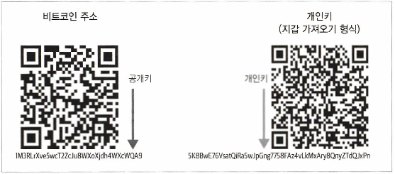

# 7장. 탈중앙화된 금융과 웹

## 신탁 재분배

---

- 은행들은 계속 혁신을 시도하고 있지만, 여전히 느리고 비용이 많이 든다.
    - 국경을 넘어 돈을 보내려면 하루 이상 걸림
- 블록체인 기반 결제 계층: 중개자 없이 거래, 시간과 비용 절감

### 해킹의 정체성과 위험성

---

- 키를 소유하지 않는 것은 자산을 소유하지 않는 것과 같다.
- 기업은 해킹 사고를 은폐하거나 무시함
    - 야후, 페이스북, 에퀴팩스, 이베이, 우버 등 개인정보 유출 사례

→ 데이터 소유권의 중요성

### 지갑

---

- 지갑은 개인키를 보관한다.
    - 코인베이스(Coinbase): 지갑 보관을 대행해주는 서비스
    - 브라우저 기반(메타마스크), 하드웨어 기반(레저) 다양

### 개인키

---

- 메타마스크와 레저 지갑은 사용자가 개인키를 알고 신중하게 저장해야 한다.
    
    → 개인키를 보호하면서 ID를 유지할 수 있는 새로운 서비스가 필요하다.
    
- 키베이스(Keybase), 블록스택(Blockstack): 개인키 관리 도와주는 Web 3.0 서비스

### 네이밍 서비스

---

- QR코드는 키의 표현이다.
    
    
    
    그림 7-1. 공개키와 개인키
    
- 이더리움 네이밍 서비스는 공개키로 변환되는 `<username>.eth` 명명 규칙을 사용할 수 있도록 한다.
    
    → 복잡한 공개키를, 읽기 쉬운 이름을 가질 수 있다.
    

## 탈중앙화 금융

---

- 디파이 서비스는 스마트 콘트랙트, 암호화폐, 블록체인을 활용
    
    
    
    그림 7-2. 기존 금융과 탈중앙화 금융
    
    - 디파이는 이더리움에서 ERC-20의 유연성을 통해 가능한 것
        
        → 유동성 풀 확장, 축소 가능하기 때문
        

### 중요한 정의

---

- 스마트 콘트랙트: 탈중앙화 공급 장치를 가지고 있다.
- 민팅(Minting): 스테이커나 인센티브용을 위해 새 블록을 생성해 수행된다.
    - 새 자산 발행 기능, 보상 시스템
- 소각(Burning): 자산의 소멸이 수반된다.
    - 공급 줄이기 → 희소성 상승 → 가격 상승 유도
- 랩드토큰(Wrapped Token): 원래 자산을 포장된 형태로 온체인에서 보유
    - 외부 자산을 ERC-20 형태로 변환 (예: BTC → WBTC)
- DAO (탈중앙화 자치 단체): 이더리움 스마트 콘트랙트를 통해 조직된 프로젝트다. 중앙 당국의 통제를 받지 않는다.
    - 거버넌스를 제공할 토큰 홀더를 보유하고 있다.
    - 금융, 게임, 소셜미디어에 사용되고 있다.
- 오라클: 외부에 정보를 제공하기 위해 필요하다. 오프체인 데이터를 온체인으로 가져온다.
    
    
    
    그림 7-3. 오라클과 블록체인의 상호작용하는 방식
    
    ❗오라클의 피드나 조작이 잘못되면 스마트 콘트랙트가 실행돼 회복할 수 없는 자금 손실이 발생한다.
    

### 스테이블코인

---

- 스테이블코인: 미국 달러화 및 기타 피아트 통화에 부합하는 블록체인 기반 자산
    - 은행 중개인이 필요 없는 서비스를 뒷받침한다.

- DAI(다이코인): 150% 담보 비율. KYC 관계가 없음
    - 담보 기반 (ETH 등), KYC 없이 사용 가능
    - 탈중앙적 스테이블코인의 대표 사례
- MKR: MakerDAO의 거버넌스 토큰. 안정성 수수료와 시스템 내 결정권
    - 메이커 시스템 유지와 정책 조정에 사용된다.
- USDC: 코인베이스와 서클이 만들었다. Centre가 구성, 그랜튼 소튼이 감사한다.
    - KYC 필수, 매월 준비금 증명한다.
- TrueUSD: TrustToken이 발행. Cohen & Cohen이 감사한다.
    - 미국 기반, 법정화폐 담보. KYC 필수
- 사용자 본인인증(KYC)과 익명성
    
    
    
    그림 7-4. 어떻게 스테이블코인을 익명으로 사용할 수 있는가?
    

## 디파이 서비스

---

- 스테이블코인 유동성 증가 → 암호화폐 기반 금융 서비스가 구축되고 있다.
- 디파이펄스(DeFi Pulse): 주목 받고 있는 프로젝트 확인 가능
    - 스마트 콘트랙트에 락업된 ETH 수를 통해 프로젝트 수요 확인

### 대출

---

- 암호화폐 보유자 대상, 담보로 대출. 투기보단 장기 보유, 피아트 전환 시 세금 회피 목적
- 대표 서비스: 컴파운드(Compound)
    - ex> DAI를 담보로 대출받고 피아트로 판매하여 암호화폐 재투자

### 예치

---

- 암호화폐(스테이블코인) 예치 시 스마트 콘트랙트 기반 이자 수익
- 메이커: DAI에 대한 저축률을 가진 DSR(DAI Savings Rate) 콘트랙트
    - 이자율은 MKR 토큰 홀더가 가변적으로 결정한다.

### 파생상품

---

- 파생상품(Derivatives): 합성자산을 위한 담보로 사용된다.
- 합성자산(Synthetics assets): 담보를 기반으로 파생 자산 생성
    - ex> ETH를 활용해 BTC 등 자산을 얻는다.
- 신세틱스(Synthetix): SNX 토큰을 소각, 발행해 이더리움 기반의 합성 자산을 거래하고 발행하는 플랫폼
    - 파생 자산에 액세스하려면 사용자가 SNX 토큰을 보유하고 있어야 한다.
        - ETH, BTC, USD, MKR, 골드, EUR, 바이낸스코인(BNB) ERC-20 버전을 지원한다.
    - SNX 담보화: 750%

## 탈중앙화 거래소

---

- DEX(탈중앙화 거래소): 개인키로 직접 거래
    - 중앙집중화 거래소: 지갑 호스팅 및 수수료 발생
- 유니스왑(Uniswap): ETH/ERC-20 교환을 쉽게 할 수 있게 하는 스마트 콘트랙트가 주를 이룬다.
    - 수수료 0.3%, 모든 트랜잭션은 블록체인에 기록한다.

### 탈중앙화 거래소와 중앙집중화 거래소

---

- 탈중앙화 거래소: 중앙집중화 권한에 의존하지 않고 사용자에게 100% 기능 제공, 신뢰 불필요
    - 단점: 속도와 확장성이 실행하는 블록체인에 의해 제한된다.

- 거래소별 기반 인프라
    - 중앙집중화 거래소: 모든 인프라는 단일 엔티티(기업)에 의해 제어된다.
    - 탈중앙화 거래소: 지역 사회에 의해 운영된다.
    
    
    
    그림 7-5. 중앙집중화 거래소와 탈중앙화 거래소 간의 인프라 차이 개요
    

- 표 7-1. 중앙집중화 거래소와 탈중앙화 거래소(유니스왑)의 프론트엔드 차이점
    
    
    | 항목 | 중앙집중화 거래소 | 탈중앙화 거래소(유니스왑) |
    | --- | --- | --- |
    | 유통 및 투명성 | 프론트엔드 코드는 거래소에 의해 비공개로 유지되며 거래소가 제어하는 인프라에서 실행된다. | 프론트엔드 코드는 유니스왑의 깃허브 저장소에서 공유된다. |
    | 운영방식 | 프론트엔드는 인프라에서 거래소와 해당 호스팅 공급자 제어로 실행된다. | 커뮤니티 내 누구나 유니스왑과 상호작용하는 자체 웹사이트를 제작할 수 있다. |
    | 기능 | 프론트엔드는 백엔드로부터 데이터를 수신한다(예: USD/ETH 시장의 환율을 취득한다).
    프론트엔드 코드는 예를 들어 거래를 실행하는 명령도 백엔드로 전송한다. | 프론트엔드 코드는 스마트 콘트랙트로부터 데이터를 수신한다. 명령은 백엔드로 전송되지 않는다.
    대신 사용자는 메타마스크와 같은 이더리움 지갑을 사용해 클라이언트 기기에서 직접 스마트 콘트랙트로 전송한다. 프론트엔드 코드는 사용자에 대한 트랜잭션을 설정함으로써 프로세스를 보다 사용하기 쉽게 만든다. |
    | 트랜잭션 승인 | 트랜잭션 허가는 프론트엔드 코드로 수행되며, 보통 쿠키 또는 액세스 토큰이 브라우저에 저장된다. | 사용자는 메타마스크에 저장된 개인키를 사용해 트랜잭션 서명을 생성한 다음 트랜잭션을 승인한다. 이후 메타마스크는 트랜잭션을 스마트 콘트랙트로 푸시한다. |
- 표 7-2. 중앙집중화 거래소와 탈중앙화 거래소(유니스왑) 타입의 차이
    
    
    | 항목 | 중앙집중화 거래소 | 탈중앙화 거래소(유니스왑) |
    | --- | --- | --- |
    | 유통 및 투명성 | 백엔드 및 데이터베이스는 거래소에서 비공개로 유지된다. 일반인은 거래소의 코드를 감사할 수 없다. | 백엔드 로직은 스마트 콘트랙트로 실행된다. 즉 유니스왑 거래소의 스마트 콘트랙트의 코드를 공개적으로 볼 수 있으므로 잠재적 사용자는 덱스를 사용하기 전에 코드를 감사할 수 있다. 모든 유니스왑 트랜잭션은 이더리움 블록체인에 기록되며, 또한 공개적으로 볼 수 있다. |
    | 운영방식 | 백엔드는 거래소 및 호스팅 공급자가 제어하는 환경에서 실행된다. 거래소는 언제든지 백엔드 서버 또는 데이터베이스를 변경할 수 있다.
    거래소, 호스팅 공급자는 언제든지 백엔드, 데이터베이스를 종료할 수 있다. | 유니스왑 스마트 콘트랙트와 트랜잭션은 수천 명의 마이너들에 의해 추진되고 기록된다. 스마트 콘트랙트와 트랜잭션은 불변이며 절대 변경할 수 없다.
    스마트 콘트랙트를 종료하거나 트랜잭션을 삭제하려면 이더리움 네트워크를 종료하는 것이 유일한 방법이다. |
    | 코드 실행 승인 | 비즈니스 로직을 실행하기 전에 백엔드는 JWT 또는 OAuth와 같은 보안 표준을 사용해 API 요청을 승인한다. | 스마트 콘트랙트 코드는 EVM(Ethernet Virtual Machine)에서 실행된다. 스마트 콘트랙트 블록을 생성하는 마이너의 노드 및 체인을 검증하고. 전체 노드를 실행하는 네트워크의 모든 노드에서 실행된다. |

- 토큰 상장
    - 중앙형: 상장 협의, 수수료, 법률 조건 필요
    - 탈중앙형: 누구나 직접 상장 가능 (ex> 유니스왑 토큰 팩토리 스마트 콘트랙트의 `createExchange()`)
        
        
        
        그림 7-8. 유니스왑 토큰의 팩토리 메서드로 누구나 유니스왑 탈중앙화 거래소에 ERC-20 토큰을 상장시킬 수 있다.
        
- 커스터디 및 거래처 리스크
    - 중앙형: 거래소가 자금 보관 → 해킹/부도 시 손실 위험
    - 탈중앙형: 스마트 콘트랙트가 자금 입출금 및 관리
        
        
        
        그림 7-9. 유니스왑의 스마트 콘트랙트에 공개적으로 기록된 8.34 SAI 토큰(약 8달러)과 0.05 ETH를 거래한다.
        

- 거래 환율
    - 중앙집중형 거래소: 환율은 매수자와 매도자가 모두 동의하는 가격으로 설정된다.
        - 로직은 백엔드 서버에 프로그래밍돼 있다.
    - 탈중앙화 거래소: 환율은 거래를 실행하는 스마트 콘트랙트에 의해 프로그래밍돼 감사를 받을 수 있다.
- 본인인증
    - 중앙집중형 거래소: 이메일, 전화번호, 정부 ID 등 KYC 필요
    - 탈중앙형 거래소: 신원 정보 없이 누구나 거래 가능
        - 공개되는 정보는 암호화폐 주소뿐
- 확장성
    - 중앙집중형 거래소: 초당 수백만 건 처리 가능
    - 탈중앙형 거래소: 블록체인의 최대 트랜잭션 속도에 의해 제한된다.(2020년 기준 초당 20건 미만)

## 플래시론

---

- 표준 대출: 담보 제공 및 상환 필요
- 플래시론: 한 거래 내에서 빌리고 사용 후 수수료 포함 상환 (트랜잭션 실패 시 전체 롤백)
    
    
    
    그림 7-12. 플래시론의 예
    

### 플래시론 콘트랙트 작성

---

- 플래시론 실행 방법의 예
    1. 플래시론을 실행할 수 있는 스마트 콘트랙트를 작성한다.
    2. 플래시론을 실행한다.

### 콘트랙트의 배포

---

- 스마트 콘트랙트를 롭스텐 네트워크에 배포하는 데 필요한 단계
    1. 스마트 콘트랙트 코드 붙여넣기
    2. 컴파일러 0.6+ 사용
    3. Deploy 시 Aave 주소 입력
    4. 배포 후 메타마스크에서 확인

### 플래시론 실행

---

- `flashloan(address _asset)` 호출하는 이더리움 트랜잭션을 수행한다.
- 입력 데이터:
    - function signature: `0x36c40477`
    - DAI 주소: `0xf80a32a835f79d7787e8a8ee5721d0feafd78108`
- 중요한 기능 호출
    
    
    
    그림 7-15. 다른 스마트 콘트랙트 사이에서 중요한 기능 호출 순서를 보여주는 흐름도
    
    1. 플래시론 시작: 사용자 -(호출)-> `flashloan` contract
    2. 대출 요청: `flashloan` contract -(요청)-> Aave lending pool
    3. 프로세스 및 전송 자금: Aave contract -(호출)-> 1 DAI를 -(이전)-> `flashloan` contract
    4. 보내진 자금 통지: executeOperation()
    5. 수수료로 자금을 상환: `flashloan` 콘트랙트 -(호출)-> Aave 콘트랙트 중 하나 (자금을 반환한다)
        - DAI 토큰 콘트랙트를 호출해 1.0009 DAI를 에이브 콘트랙트로 이전한다.

### 차익 거래를 위한 플래시론

---

- 여러 디파이 플랫폼 간 가격 차이를 이용한 차익거래
    - 이점: 차익거래에 참여하는 거래소에 자산을 일시적으로 보유할 필요가 없다.
    - ex> wETH/wBTC 환율 차이 활용 → 유니스왑과 Fulcrum 활용

### 풀크럼 플랫폼 해킹 사건

---

- 2020년 2월, 해커가 플래시론을 사용해 bZx의 선물 거래소, Fulcrum의 마진 트레이딩 플랫폼에서 오라클 조작 공격을 수행
- 오라클: 신뢰할 수 있는 외부 뷰를 제공하는 스마트 콘트랙트를 제공한다.
    - 디파이 스마트 콘트랙트에서는 오라클로 BTC/USD 환율을 알 수 있다.
- 오라클 조작 공격을 수행한 플래시론 콘트랙트 트랜잭션 ID: `0xb5c8bd943b6cc87a0e2fe110ece6bf527fa4f170a4bc8cd0327f68cf5219838`
- 공격 과정
    
    
    
    그림 7-16. 풀크럼 공격의 진행
    
    1. 차입: dYdX 탈중앙화 거래 플랫폼에서 10,000 ETH 대출
    2. 사재기: 디파이 대출 플랫폼 Compound에서 112wBTC 대출
        - 자금 확보를 위해 5,500 ETH를 담보로 제공하고 있다.
    3. 오라클 환율 조작: Fulcrum에 1,300 ETH 예치 + Kyber에서 wBTC 구매
    4. 새로운 환율로 거래: 유니스왑에서 6,871 ETH 획득
    5. 대출금 상환: dYdX에 10,000 ETH 상환, 차익 1,371 ETH 발생

## 프라이버시

---

- 비트코인, 이더리움 같은 퍼블릭 블록체인은 개인정보 보호 측면이 미흡하다.
    - 모든 트랜잭션 정보는 공개되며, 송수신자의 거래량과 주소가 포함된다.
- 프라이버시 향상을 위해 제트캐시(Zcash), 모네로(Monero) 같은 프라이버시 중심의 블록체인이 출시됐다.
- 허용된 참여자만 접근 가능한 프라이빗 블록체인 네트워크도 있다.(ex> 코다, 쿼럼)

### 영 지식 증명서

---

- 증명자가 검증자에게 진술이 참이라는 것을 증명하는 암호화 방법/프로토콜, 그 내용을 노출하지 않는 방식
    - ex> “월리를 찾았다”는 것을 직접적으로 공개하지 않고 증명할 수 있음
- ex> 웹사이트 로그인 시 사용자 비밀번호를 직접 저장하지 않고 암호 해시 증명으로 대체 가능
    - 취약점
        - 중간자 공격
            - 해커가 사용자와 서버 간의 통신을 손상시킬 때 일반 텍스트 암호를 가로챌 수 있다.
        - 무차별 대입 및 사전 공격
- 대안: SRP(Secure Remote Password) 프로토콜로 구현
    - 서버가 솔트 또는 무작위 데이터와 암호 해독이 불가능한 검증기(verifier)를 저장한다.
    - 사용자가 로그인할 때 사용된 일회성 값을 보낸다. 서버는 수신하여 SRP를 통해 유효한 암호를 가진 사용자에 의해 전송됐는지 확인할 수 있다.
    
    
    
    그림 7-17. SRP의 등록 작업 흐름
    

- 영 지식 증명
    - 장점: 시스템의 개인정보 보호와 보안이 크게 향상된다.
    - 단점: 처리 능력과 하드 드라이브 공간에는 추가 비용이 발생한다. 두 당사자(증명자 및 검증자)가 서로 직접 상호작용해야 한다.

- 비인터랙티브 지식 논쟁
    - zk-SNARKs: 비인터랙티브 지식 논쟁 방식의 개인정보 보호 기술
    - 단점: 많은 가스 비용, EVM(이더리움 가상 머신)에서 직접 구현 어려움

### 제트캐시

---

- 거래 정보를 공개/비공개로 만들 수 있는 옵션을 제공하는 개인정보 중심의 블록체인
- zk-SNARKs를 사용한다.

- zk-SNARKs 구현은 퍼블릭 블록체인에 유용하다.
    - 퍼블릭 블록체인(비트코인, 이더리움)에서 프라이빗 트랜잭션을 허용
    - 퍼블릭 블록체인의 스마트 콘트랙트 코드 비공개 실행 허용

### 링 서명

---

- 트랜잭션 서명자의 신원을 그룹 내 다른 사람들과 섞어 식별 불가능하게 함.
- 모네로(Monero)에서 사용하고 있다.
    - UTXO를 숨기기 위해 혼란 유발 코인(decoy) 출력 및 링 서명 기술도 사용하고 있다.

## 웹 3.0

---

- 웹 3.0: 이전 두 세대에서 생성된 데이터가 반환되고, 수익성이 생기며 사용자가 제어한다.
    - 탈중앙 플랫폼과 프라이버시 중심 웹 환경
    - ex> 브레이브(Brave) 브라우저: 광고 차단 + BAT 토큰 보상 구조

- 관련 기술
    - IPFS(InterPlanetary File System): 탈중앙 파일 을 가능하게 하는 영구적인 네트워크
    - 블록스택(Blockstack): 분산 ID, 탈중앙화 시스템으로 구축한 초기 프레임워크.
    - 무손실 도박: 게임형 DAO 플랫폼. 우승자가 풀에서 벌어들인 보상을 모두 받고 패자는 원래 투자한 스테이블코인을 돌려받는 방식 지급.

## 요약

---

- 블록체인, 암호화폐, 스마트 컨트랙트를 통해 개인정보 통제를 사용자에게 돌려주는 방법을 연구하고 있다.
