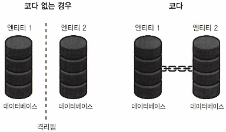

# 9장. 기타 블록체인

## 블록체인은 무엇에 좋은가?

---

- 블록체인은 암호화폐와 투기 외에도 여러 용도로 사용되고 있다.

- 블록체인 구축을 위한 핵심 기술
    - 합의(Consensus): 새로운 레코드의 유효성을 검사해 파손을 방지
    - 해시(Hashing): 레코드 통합해 감사 추적을 유지
    - 암호화(Encryption): 디지털 데이터 전송 보호
    - 분산화(Distribution): 퍼블릭 원장 레코드를 공유

- 블록체인이 수행하는 기능
    - 자기조직화(합의): 블록 생성 간격에 관계없이 일정한 시간 단위로 데이터를 처리할 수 있다.
    - 영구적인 레코드(해시): 이미 블록에 배치된 정보는 수정이 매우 어렵다.
    - 자산 이동(암호화): 서드파티 개입 없이 자산 전송.(암호화폐 단위)
    - 데이터 공유(분산화): 신뢰가 필요하지 않은 여러 당사자들은 블록체인을 사용해 협업할 수 있다.

## 데이터베이스와 원장

---

- 데이터베이스는 중앙집중형 구조이며, 원장은 기록 보관 시스템을 설명하는 데 사용되는 용어다.
- 기업이 사용하는 데이터베이스는 지속적으로 복제/업데이트 된다.
- 퍼미션리스 블록체인: 누구나 참여할 수 있다. 계좌와 결제가 내장된 분산 컴퓨팅 시스템
- 블록체인은 중앙집중식 이윤 추구 대신 합의된 인센티브를 통해 정보를 공유할 수 있다.

## 탈중앙화와 중앙집중화

---

- 초기 암호화폐는 탈중앙화를 지향하였으나, 조직을 위해 개발된 플랫폼은 훨씬 중앙집중적이다.

### 참가자

---

- 퍼블릭 블록체인: 누구나 채굴 가능하다.
- 프라이빗 블록체인: 참여자 통제가 필요하다.

### 분산 검증 원장의 주요 특성

---

- 승인 통제(Admission Control): 원장이 허용하는 내용과 형식에 대한 정의가 있어야 한다.
- 합의(Consensus): 체인이나 원장 정보의 유효성에 동의하는 것.
- 검증(Verification): 네트워크에서 일어난 이벤트가 정확하고 의도된 대로 수행되도록 보장한다.
- 집행(Enforcement): 비트코인과 같은 블록체인은 네트워크의 모든 사람이 가장 긴 체인에 동의한 특정 블록에 해당하는 체크포인트를 추가해 집행을 제공한다.

## 이더리움 기반 프라이버시 구현

---

- 퍼블릭 블록체인과 암호화폐 네트워크는 기업에서 쓰기에 적합하지 않다.
    - 경쟁적인 이유, 규정 준수 또는 기타 요인으로 인해 정보를 통제해야 하기 때문이다.
- 개인정보 보호 문제를 해결하기 위하여, 조직은 이더리움 블록체인을 포크하고 필요한 개인정보 보호 기능을 포함해 사용자 정의 구현체를 만들어야 한다.

### 나이트폴

---

- 회계법인 EY가 개발한 나이트풀은 이더리움을 기반으로 한 프라이버시 구현 기술이다.
- 스마트 콘트랙트 기술에 개인정보 보호 기능을 추가해 ERC-20 및 ERC-721 토큰을 프라이빗 블록체인으로 구동할 수 있게 하며,  조크라테스(Zokrates)의 Zk-SNARKs 기반의 영 지식 증명을 제공한다.

### 쿼럼

---

- 투자은행 JP모건이 개발한 쿼럼은 이더리움 기반 블록체인으로 프라이빗 트랜잭션/콘트랙트를 지원해 익명성을 보장한다.
- 영 지식 증명 기술을 사용해 개발한 제더(Ether) 프로토콜을 사용한다.
    - ERC-20 콘트랙트에 연결돼 프라이빗 제더 계정을 만든다.
    - 비대칭키 암호화 기술 엘가말(ElGamal) 암호화를 사용해 각 계정 잔액을 암호화한다.

## 엔터프라이즈 구현

---

- 처음부터 자체 솔루션을 구축하기로 결정한 기업이 많다.

### 하이퍼레저

---

- 리눅스 재단에서 호스팅하는 블록체인 개발을 위한 오픈소스 플랫폼이다.
- 잘 알려진 하이퍼레저 프로젝트
    - Go 언어를 사용하는 원장 기술 패브릭(Fabric) 프로젝트
    - C++ 로 구현된 다국어를 지원하는 이로하(Iroha), 소투스(Sawtooth) 프로젝트
- IBM과 오라클 등 많은 엔터프라이즈 블록체인 프로젝트가 이 프레임워크를 기반으로 한다.

### 코다

---

- 컨소시엄 R3가 개발한 **코다**는 프라이버시 중심의 엔터프라이즈 블록체인이다.
    - 기업 간 거래를 더 신뢰할 수 있고 효율적으로 만들기 위해 고안됐다.
- JVM 기반으로 작동하고, 관계형 데이터베이스와 연동하여 기존 시스템과 통합이 쉽다.
- 스마트 컨트랙트는 콘트랙트 코드와 함께 법률 언어를 사용한다.

- 코다 작동방법
    - 코다가 없으면 두 회사의 데이터베이스는 고립된다.
    - 회사들은 안전하게 거래를 관리하기 위해 코다로 협력할 수 있다.
    
    
    
    그림 9-1. 코다를 통해 프라이버시를 보호하면서 협업이 가능하게 한다.
    

- 퍼블릭 블록체인의 속성
    - 기업이 혜택을 볼 수 있는 속성
        - 트랜잭션 불변성(Transaction immutability): 거래가 원장에 추가되면 변경하거나 제거할 수 없다.
        - 피어 검증(Peer validation): 트랜잭션이 원장에 추가되기 전에 다른 네트워크 참가자는 트랜잭션이 유효한지 여부를 결정한다.
    - 기업에 매력적이지 않은 블록체인의 속성
        - 트랜잭션 투명성(Transaction transparency): 누구든 거래를 확인할 수 있지만 기업은 이를 원하지 않을 수 있다.
        - 제한된 확장성(Limited scalability): 초당 수백만 건의 거래를 처리하기 어렵다.
        - 새로운 프로그래밍 언어와 개념: 퍼블릭 블록체인에서 실행되는 디앱은 솔리디티나 바이퍼와 같은 새로운 언어로 개발해야 한다.
        - 퍼미션리스(Permissionless): 누구든 네트워크에 참여할 수 있어, 거래 대상을 통제하기 어렵다.
        - 숨겨진 정체성(Hidden identities): 참가자는 블록체인 주소로 식별되며, 이로 인해 많은 참가자들이 익명성을 갖게 된다. 참여자 식별이 어렵다.

- 코다 네트워크
    - 코다의 네트워크는 노드들(법적 주체)이 상호 직접 연결된 피어 투 피어 네트워크이다.
        - 노드마다 하나 이상의 코다 응용 프로그램으로 인스턴스를 실행한다.
        - 일부 노드는 허가 서비스 역할을 수행한다.
        
        
        
        그림 9-2. 코다 네트워크의 예
        
    - 거래 가시성은 관련된 노드에만 제한되며, 모든 노드가 전체 거래를 보지 않는다.
    - 트랜잭션은 디지털 서명과 함께 저장된다.

- 코다 합의
    - 타당성 합의: 모든 서명이 유효하고 스마트 컨트랙트 제약 조건을 충족해야 한다.
    - 고유성 합의: 입력이 이중 사용되지 않았음을 검증한다.

- 코다 언어: 디앱은 자바로 작성됐으며 Oracle, PostgreSQL 등 다양한 엔터프라이즈 DB와 함께 작동한다.

### DAML

---

- 디지털자산(Digital Asset)이 개발한 스마트 컨트랙트 언어
- 다양한 블록체인 플랫폼을 지원하며 콘트랙트가 체결된 후 원장이나 스토리지 모델을 변경할 수 있다.

## 서비스로서의 블록체인

---

- 아마존 퀀텀 렛저(QLDB): 암호화로 보호되며, 이더리움과 하이퍼레저 패브릭 프레임워크를 사용하는 원장
    - 장점: 사용자가 직접 변경할 수 없고 암호화된 안전한 원장을 제공한다.
    - RDB보다 좋은 점
        1. 불변성(Immutability) 보장
            - QLDB는 데이터 변경이 불가능한 변경 내역 전체를 암호화하여 보관하는 원장(Ledger) 형태로 동작한다.
            - 관계형 DB는 수정과 삭제가 자유롭기 때문에 임의로 데이터가 변경될 가능성이 있지만, QLDB는 한 번 기록된 데이터를 수정할 수 없어서 데이터 변조 위험이 없다.
        2. 암호화된 검증 가능성(Cryptographic Verifiability)
            - 데이터가 블록체인과 유사한 암호학적 해시(해시 체인) 방식으로 연결돼서 데이터 변경 여부를 즉시 검증할 수 있다.
            - 이는 감사(Audit), 규제 준수, 보안이 중요한 금융거래, 공급망 관리 등에서 매우 유용하다.
        3. 투명한 감사 및 규제 준수
            - QLDB는 기록된 데이터가 언제, 어떻게 바뀌었는지를 정확히 알 수 있도록 이력 추적을 기본적으로 제공한다.
            - 금융, 법적, 의료 분야처럼 엄격한 감사와 규제가 요구되는 곳에서는 필수적인 요구사항이다.
        4. 블록체인의 단점을 보완한 중앙 집중식 원장
            - 블록체인처럼 투명성과 불변성을 제공하지만, 탈중앙화로 인한 성능 저하 없이 중앙 집중식으로 높은 성능을 제공한다.
            - 퍼블릭 블록체인처럼 네트워크 참여자의 동의 과정이 없어서 낮은 지연 시간(Low latency)과 높은 트랜잭션 처리량(High throughput)을 제공한다.
        5. 관리 편의성 및 확장성
            - AWS가 관리하는 서비스 형태로 제공돼서 인프라 운영, 스케일링, 유지 보수에 대한 관리 부담이 없다.
            - 복잡한 DB 관리 없이 AWS가 자동으로 높은 가용성과 내구성을 보장한다.
    - 관계형 DB로는 불충분한 이유
        - 관계형 DB도 트랜잭션 처리나 일관성을 제공하지만, 데이터의 변경 가능성을 원천 차단하거나 변경이력의 무결성을 암호학적으로 보장하진 않는다.
        - 변경 이력을 관리하려면 별도 로직을 구현해야 하는데, 이렇게 직접 구현할 경우 오히려 개발 및 관리 비용이 증가할 수 있다.
    - QLDB가 특히 유용한 사례들
        - 금융거래 내역 추적: 계좌 잔액, 거래내역 무결성 보장
        - 공급망 관리: 상품의 이동 이력 추적
        - 의료 기록 관리: 환자 데이터의 불변성 유지
        - 법률 계약 및 서류: 계약서, 공증 문서의 무결성 보장
- 애저: 마이크로소프트의 애저 클라우드 플랫폼. 다양한 블록체인 및 스마트 콘트랙트 개발 지원
- VM웨어: EVM, DAML 및 하이퍼레저를 지원하는 멀티 블록체인 플랫폼. 탈중앙화, 보안 강화 인프라 제공
- 오라클: 하이퍼레저 패브릭에 구축된 블록체인 플랫폼. 사기 방지를 위해 변조 방지 블록체인 테이블 지원
- IBM: 하이퍼레저 패브릭을 지원하는 도구 세트를 핵심 기술로 제공한다. 오픈시프트 컨테이너 플랫폼을 통해 배포된다.
- SAP: 하이퍼레저 패브릭 및 이더리움 메인넷을 지원한다.
    - SAP HANA와 연동 가능한 블록체인 시스템 제공

## 뱅킹

---

- 은행권은 블록체인을 실험적으로 도입하고 있으며, 비용 절감 목적으로 활용 가능성을 탐색 중이다.

### 로열 민트

---

- 영국의 동전 생산 업체. 시카고 상업 거래소(CME)와 제휴해 금에 묶인 블록체인 기반 자산을 만들었다.
- 비트고가 지갑 및 KYC 기술을 제공하기로 했으나 2018년 말에 CME가 중단했다.

### 프랑스 중앙은행

---

- 2016년, 유로화 지불을 위한 디지털 정체성을 바탕으로 실험을 진행했다.
- 최근에, 암호 경제학과 하이퍼레저, 코다 및 쿼럼 플랫폼에 정통한 블록체인 전문가 구인 공고를 발표했다.

### 중국

---

- 국가 계획하에 블록체인 기반 디지털 위안화 추진

### 연방준비제도

---

- 미국의 중앙은행은 수년 간 암호화폐를 관찰했다.
    - 2019년 보스턴 연방준비제도이사회는 이더리움과 하이퍼레저 기반 블록체인 테스트를 기술한 논문을 발표했다.
        
        
        
        그림 9-4. 보스턴 연방준비제도이사회(보스턴 연준) 시험설계-하이퍼레저에서 ‘체인코드’는 스마트 콘트랙트를 의미한다.
        

### JP모건

---

- 투자은행 JP모건은 이더리움을 기반으로 자체 블록체인 쿼럼과 JPC 스테이블코인을 개발했다.
- 글로벌 송금 효율화를 위한 실험을 수행하고 있다.
    - 사용자는 은행에 피아트를 입금하고 JPM 코인을 발행받아 다른 곳에서 피아트 지불을 위해 상환 가능

## 퍼미션드 원장 사용

---

- 퍼미션드 시스템에 대한 사례는 개방형 블록체인의 사례와 매우 다르다.
    - 기업은 속도, 개인정보 보호 및 개발 기능을 요구하며, 이에 따라 테스트 및 검증된 허가된 플랫폼이 개발되었다.

### IT

---

- 보안은 엔터프라이즈 IT 시스템의 항상 존재하는 구성요소
    - DAML SDK는 비주얼 스튜디오에서 개발 가능한 환경과 스마트 컨트랙트 테스트 툴 제공한다.

### 뱅킹

---

- 은행들도 증권화, 현금화, 결제 시스템에 블록체인 기술을 연구하는 경우가 늘고 있다.
- 산탄데르 은행이 발행한 디지털 채권. 관리인, 발행인 및 투자자들은 토큰을 사용한다.
    
    
    
    그림 9-5. 산탄데르에 의한 블록체인 발행 채권 설계 프로세스
    

### 중앙은행 디지털 통화

---

- CBDC: 한 나라의 피아트통화의 디지털 형태
    - 중개인이나 은행과 같은 제3자를 요구하는 대신 당사자간에 직접 실시간 지불을 가능하게 한다.
    - 기존 DB를 사용할 수 있지만, 블록체인이나 분산 원장 기술을 도입하는 것도 고려되고 있다.
- 한국, 중국, 미국, 스웨덴, 영국 등이 테스트 중
    1. 모의실험 단계 (2021~2022년)
        - 한국은행은 2021년부터 분산원장 기술 기반의 CBDC 모의시스템을 구축하여 기본 기능인 발행, 유통, 환수 등을 실험하였다. 이후 2022년에는 오프라인 결제, 이자 지급, 국가 간 송금 등 확장 기능에 대한 실험을 성공적으로 완료하였다.
    2. 금융기관 연계 실험 (2022년 하반기)
        - 2022년 하반기에는 15개 금융기관과 함께 CBDC 모의시스템을 실제 IT 환경에서 연계하여 실험하였다. 이 실험을 통해 시스템의 성능과 안정성을 확인하였으며, 분산원장 기반 시스템의 운영 복원력이 우수하다는 평가를 받았다.
    3. 프로젝트 한강 – 일반 국민 대상 실거래 실험 (2025년 4~6월)
        - 2025년 4월부터 6월까지는 '프로젝트 한강'이라는 이름으로 약 10만 명의 일반 국민을 대상으로 CBDC 실거래 실험을 진행하고 있다. 참가자들은 시중은행의 모바일 앱을 통해 예금 토큰을 발급받아 실제 상점에서 결제하는 등의 경험을 하게 된다.

### 법률

---

- 블록체인은 불변의 기술 혁신으로서 법적 절차에서 정보를 검증하는 데 도움이 된다.
    - ex> 미국 법무법인 베이커호스테틀러는 화물 계약을 위해 스마트 컨트랙트를 사용하고 있다.

### 게임

---

- 고유성을 상징하는 디지털 자산과 연결된 아이템 개념이 인기를 끌고 있다.(이더리움 기반의 크립토키티)
- 부정행위에 대처하기 위해서도, 블록체인 기술이 이용된다. 게임을 조작할 수 없다.

### 헬스 케어

---

- 구글은 검증 가능한 데이터 감사라는 것을 연구하고 있다.
    - 데이터 기록을 암호화하는 원장 기반 시스템
- 환자의 의료 기록 접근에 블록체인 기술 활용 연구 중

### 사물인터넷

---

- 스마트 디바이스가 대규모 네트워크와 협력할 때 보다 효율적으로 동작한다.
- IoT 기기와 상호 작용하며 하이퍼레저 패브릭 기반 IBM 블록체인 플랫폼과 데이터를 안전하게 저장한다.

### 결제

---

- 블록체인 기반 결제에는 역할이 있지만, 오픈 블록체인은 비자와 같은 기존 네트워크와 여전히 경쟁 중이다.
- 법인 결제, 은행 간 결제, 개인 간 결제 각각에서 활용 가능성 존재

## 리브라

---

- 2019년 발표한 페이스북 주도 프로젝트. 글로벌 디지털 통화를 목표로 했다.

### 리브라 협회

---

- 완전히 새로운 블록체인 시스템을 구현하기 위해 모인 조직의 컨소시엄
    - 결제: PayU
    - 기술: Facebook, FarFetch, Lyft, Spotify, Uber
    - 통신: Iliad
    - 블록체인: Anchorage, BisonTrails, Coinbase, Xapo
    - 벤처 캐피탈: Andreessen Horowitz, Breakthrough Initiatives, Union Square Ventures, Ribbit Capital, Thrive Capital
    - 비영리 단체: Creative Destruction Lab, Kiva, Mercy Corps, Women’s World Banking

### 기존 블록체인에서 빌려오다

---

- 리브라 협회는 핫스터프를 활용해 LibraBFT로 인터넷에서 완전히 새로운 결제 시스템을 만들려고 했다.
    - 협회 회원들은 시스템의 검증자가 된다.
    - 높은 처리량과 낮은 지연 시간을 목표로 설계되었으며, 초당 약 1,000건의 거래를 처리하고 약 10초 이내에 거래를 확정하는 성능을 지향하였다.
- 핫스터프(HotStuff): VM웨어가 개발한 합의된 비잔틴 장애 허용 알고리즘. 유효성 검사기.
    - 클라이언트의 트랜잭션을 받아들이고 검증을 위해 투표 메커니즘을 사용한다.

- 리브라 암호화폐는 법정 화폐와 국채를 포함한 자산들을 바스켓에 연동해 안정적인 가치를 유지할 것이다.
    
    
    
    그림 9-7. 리브라의 합의 메커니즘
    
    - 무브(Move)라는 새로운 프로그래밍 언어를 사용한 스마트 콘트랙트 사용을 지원할 것이다.
        - 리브라 블록체인의 상태를 업데이트할 수도 있다.
    - 검증된 검증자와 특정 리소스 유형을 사용하면 이더리움보다 범위가 더 제한될 수 있다.

❗각국 규제 기관의 강한 반발로 인해 프로젝트는 여러 차례 방향을 수정하였고, 결국 2020년 디엠(Diem)으로 리브랜딩 되었다.

- 디엠은 미국 규제에 더 초점을 맞췄지만, 규제 압력과 주요 파트너사 이탈로 2022년 자산을 실버게이트 캐피탈에 매각하며 프로젝트를 종료하였다.

### 노비

---

- 노비(Novi): 페이스북은 거래를 용이하게 하기 위해 자체 지갑을 개발할 예정이다.
    - 디엠 중단과 함께, 2022년 9월부로 종료했다.

### 리프라 프로토콜 동작 방법

---

- 리브라 네트워크: 유효성 검사기 노드와 풀 노드로 구성되었다.
    - 풀 노드: 실시간 상태 브로드캐스트 및 트랜잭션 처리

- 블록
    - 블록은 리더에 의해 선출되며, 쿼럼 인증을 통해 연결된다.

- 트랜잭션 구조
    - 이더리움과 유사한 방식의 계좌 기반 모델이기 때문에 입력과 출력이 없다.
    
    
    
    표 9-1. 리브라 트랜잭션의 구조
    

## 요약

---

- 완전한 프라이빗 블록체인을 원하는 기업이 있어 R3 코다 구현이 유용하기도 하고, 대중이 사용할 수 있는 네트워크를 바라는 수요(리브라 프로젝트가 채우려는 역할)도 있다.
- AWS는 배치와 개발이 쉬워 경쟁력이 있음에도 불구하고 아직 절대적 지배력은 없음
- 비트코인이나 이더리움 같은 공개형 네트워크는 블록체인의 세계를 만들어냈다.
    - 현재 기업들은 블록체인 개념을 취해 운영의 여러 측면을 개선하기 위해 사용하고 있다.
