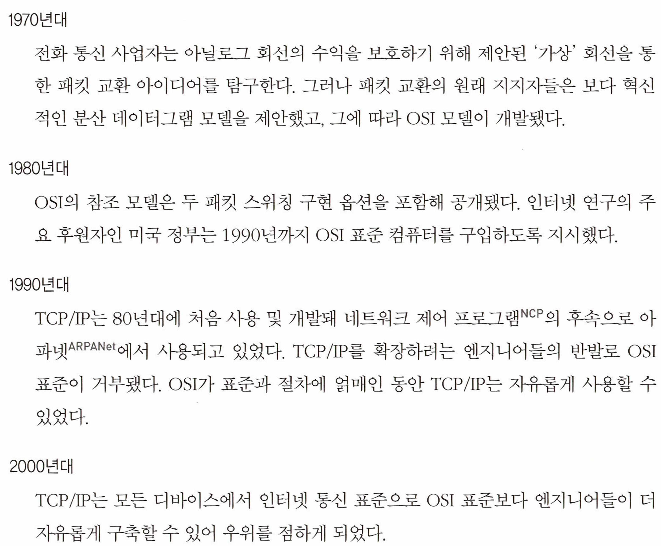

# 10장. 블록체인의 미래

- 오늘날의 블록체인과 암호화폐를 인터넷 초창기와 비교하는 일이 완전히 잘못됐다고 볼 수는 없다.
    - 블록체인은 여전히 초기 단계이며, 채택 소비자는 매우 적고 기술을 채택하는 과정도 혼란스럽고 어렵다.
    - 반면, 개발자 입장에서는 블록체인 산업의 미래를 형성할 수 있는 엄청난 기회가 있음을 의미하기도 한다.
    - 인터넷은 유연하고 뛰어난 적응력이 진보를 위한 길이라는 교훈을 준다.
        - 초창기 인터넷에 대한 사람들의 인식과 한계점
            - 기술적 제한성
                - 초기 인터넷(ARPANET)은 소규모의 학술기관과 군사 네트워크 간의 데이터 교환을 위한 실험적 시스템으로 출발했다.
                - 당시 네트워크 속도는 매우 느렸으며, 제한된 정보 교환만 가능했기 때문에 실생활에서 광범위한 활용 가능성을 확신하지 못했다.
            - 상업적 활용의 부재
                - 초창기 인터넷은 상업적 이용이 엄격히 금지되어 있었다. 1990년대 초까지도 인터넷에서 상업 활동이 허용되지 않았기 때문에 비즈니스적 가능성을 크게 보지 않았다.
                - 이로 인해 일반인과 기업들은 인터넷의 잠재력을 인지하기 어려웠다.
            - 미래에 대한 불확실성
                - 인터넷의 초기 개발자조차 인터넷이 향후 어떠한 형태로 발전할지 명확하게 예측하지 못했다.
                - 심지어 인터넷의 선구자 중 한 명인 밥 멧칼프는 "인터넷은 1996년에 붕괴할 것"이라고 잘못된 예측을 하기도 했다.
        - 전환점과 적응을 통한 발전
            - 인터넷이 본격적으로 주목받기 시작한 계기는 웹(World Wide Web)의 등장과 그래픽 기반 웹 브라우저의 보급이었다.
            - 이후 사용자가 급증하면서 전자상거래, 검색 엔진, SNS와 같은 혁신이 나타났고, 인터넷은 급속히 진화하며 다양한 분야로 확장되었다.

## 더 많은 것들의 변화

---

- 1960~2000년대까지 통신 표준의 변화를 설명하며 OSI와 TCP/IP의 대립 → TCP/IP의 승리
    
    
    
- 인터넷 표준의 역사는 블록체인 발전사와 유사하게, 개방성과 효율성을 중시한 진영이 승리한 흐름이다.
- 블록체인의 생태계도 시간이 지나면서 다양한 표준이 경쟁하고, 결국 실용적인 방식이 채택될 것이다.

## 주목해야 할 블록체인

---

- 프라이버시, 효율성 또는 향상된 스마트 컨트랙트 기능으로 인해 다음 세 가지 플랫폼을 주목해야 한다.
    - EOS
        - 자원 사용을 줄이는 모델을 사용해 블록당 트랜잭션 수를 늘리고 수수료를 요구하지 않으며,
        - 소수의 집중 노드만 활용해 블록체인상의 사용자에게 트랜잭션 대역폭을 제공한다.
        - 위임지분 증명(DPoS) 방식을 사용하는 제3세대 암호화폐다.
        - Vaulta
            - 2025년 3월, Vaulta로 리브랜딩하며 Web3 기반 디지털 뱅킹 플랫폼으로 전환을 선언했다.
            - 목표: 탈중앙화 금융(DeFi), 소비자 결제, 보험, 자산 관리 등을 포함하는 종합 금융 서비스
            - Antelope Spring 프로토콜을 통해 블록 생성 속도를 1초로 단축하고, 스마트 컨트랙트 실행을 최적화하는 등 기술적 업그레이드를 진행 중이다.
            - EOS 가격은 여전히 2018년 최고점 대비 약 97% 하락한 상태. 투자자 신뢰 회복이 필요한 상황
    - 카르다노
        - 위임 지분 증명을 활용한 스마트 컨트랙트 플랫폼
            - 사용자는 ADA를 스테이킹 풀에 위임하여 검증자(풀 운영자)를 선택
            - 멀티 서명 주소 구조, 하스켈 기반의 라이브러리로 과학적이고 구조적인 방식으로 설계됨
            - 온라인에서 지속적 보상을 원하는 사람은 위임, 기술력 있는 검증자는 직접 풀을 운영
        - 2025년 들어 실생활에서의 활용 사례가 증가하고 있다.
            - 디지털 신원 인증, 소액 대출, 공급망 추적 등 다양한 분야에서 블록체인 기술이 적용되고 있으며, DeFi 생태계의 총 예치 자산(TVL)은 7억 달러를 돌파했다.
            - Hydra와 같은 레이어 2 솔루션을 통해 확장성과 스마트 컨트랙트 기능을 강화하고 있으며, 이러한 발전은 ADA의 가치 상승에 긍정적인 영향을 미칠 것이다.
    - 모네로 (XMR)
        - 프라이버시를 구현하고 현금 등 거래를 실행할 수 있는 능력으로 주목받는 블록체인
        - 3가지 암호 전략 구현: 링 서명, 링 기밀 거래, 스텔스 주소
            - 거래 내역을 비공개로 한다.
        - 2025년에도 강력한 프라이버시 보호 기능으로 주목받고 있다.
            - 특히, 4월에는 가격이 65% 급등하며 시장의 관심을 끌었다.
            - 모네로는 ASIC 채굴을 방지하기 위해 RandomX 알고리즘을 도입하여 CPU 기반 채굴을 장려하고 있으며, 이는 탈중앙화를 유지하는 데 기여하고 있다.

### 모네로 동작 방법

---

- ex> 두 주소 간 0.5 XMR의 거래
    - 대중에게 보이는 거래 세부 사항
        
        
        
    - 입력은 공개적으로 볼 수 있다.
        
        
        
        
        
    - 출력
        
        
        
    - 대중에게 숨겨진 입력
        
        
        
    - 숨겨진 출력
        
        
        

- 링 서명과 모네로의 익명성
    - 링 서명은 모네로 트랜잭션에서 발신인의 공개 주소를 숨긴다.
        - 비트코인과 유사한 UTXO 방식을 따르지만, 모네로는 트랜잭션 생성 시 다수의 미끼 입력을 섞어 발신자 추적을 어렵게 한다.
        - 실제 자금을 보내는 입력은 1개뿐이며, 어떤 입력인지 공개적으로 알 수 없다.
    - 키 이미지로 이중 지출 방지
        - 모든 트랜잭션에는 고유한 키 이미지가 생성되어 포함된다.
        - 같은 키 이미지가 이미 사용된 적 있다면 이중 지출로 판단하여 방지할 수 있다.

- 링 비밀 트랜잭션(Ring CT): 트랜잭션 금액을 숨기기 위한 프라이버시 기능
    - 암호화를 통해 송금액을 숨기며, 발신자와 수신자만 정확한 금액을 알 수 있다.
        - 모든 모네로 주소에는 개인/비밀 뷰 키가 있다.
        - XMR을 받은 주소의 owner는 개인/비밀 뷰 키로 보낸 금액을 복호화할 수 있다.
    - 마이너는 거래가 유효한지만 확인하며, 정확한 금액에는 관심을 두지 않는다.

- 스텔스 주소: 수신자의 주소를 숨기는 기능
    - 발신자는 수신자의 공개 키, 소비 키 등을 이용해 새로운 스텔스 주소를 생성하여 송금한다.
    - 이로 인해 블록체인 상에서 특정 수신자를 식별하기 어렵다.

### 밈블웜블, 빔, 그린

---

- 밈블윔블(Mimblewimble): 확장성과 프라이버시를 강화한 블록체인 프로토콜
- 불렛프루프(Bulletproofs): 영지식 증명 기술, 트랜잭션 유효성 확인 후 상태 전환은 블록체인에 기록돼 세부 사항을 가린다.
- 대표 적용 프로젝트: 빔(Beam), 그린(Grin)
    - ASIC 저항성, 확장성, 프라이버시와 같은 몇 가지 주요 속성을 공유한다.
- 차이점
    - 빔: C++ 언어로 구현, 이퀴해시 기반 작업 증명, 공급량 제한, 스크립트 없는 스크립트 사용
    - 그린: 러스트 언어로 구현, 쿠쿠 사이클 기반 작업 증명, 무한 공급, 제한된 스크립팅

## 스케일링 문제

---

- 비트코인은 초당 3~7건의 거래만 처리 가능 → 해결을 위한 새로운 아이디어가 필요함
    - 암호화폐 네트워크가 대규모로 성장하기엔 효율성과 확장성이 부족하다.

### 사이드 체인

---

- 온라인 데이터를 오프로딩하는 방법. 메인 블록체인에 트랜잭션 추가 정보를 전달한다.
    - ex> 비트코인의 리퀴드 네트워크(Liquid Network)
- 양방향 페그(two-way peg) 개념을 사용한다.
    - 사용자가 한 체인에서 다른 체인으로 자금을 분산시키는 방식으로 이동할 수 있게 해준다.

### 샤딩

---

- 대용량 데이터를 분할해 노드 간 데이터 부담을 줄이는 구조. 네트워크의 다른 노드와 공유된다.
- 안전한 데이터를 공유하기 위해 안전한 프로토콜이 있어야 하기 때문에 복잡성을 높이는 요소다.

### 스타크

---

- zk-STARKs: 확장 가능한 투명한 영지식 논증 → 블록 크기를 줄이고, 확장성을 높이는 데 기여한다.
    - 영지식 증명(zero-knowledge proof)을 사용해, 거래의 정당성을 증명하면서도 개인정보는 노출되지 않도록 한다.
    - STARK는 SNARKs와 달리 trusted setup이 필요 없고, 해시 함수만으로 증명을 구성한다.
        - zk-SNARK는 암호학적으로 보안이 유지되려면, 미리 설정된 암호 파라미터가 있어야 하며, 이 파라미터가 악의적으로 조작되지 않아야 한다.
            - 만약 이 암호 파라미터 중, 비밀 파라미터 정보를 보관/유출하면 위조된 증명을 만들 수 있다.
            
            → 그래서 이 파라미터를 생성하는 과정이 공정하고 믿을 수 있어야 한다는 의미에서 Trusted Setup이라 부른다.
            
    - STARK vs SNARK 비교표
        
        
        | 항목 | SNARK (zk-SNARKs) | STARK (zk-STARKs) |
        | --- | --- | --- |
        | 풀네임 | Succinct Non-interactive Argument of Knowledge | Scalable Transparent Argument of Knowledge |
        | 신뢰 설정 (Trusted Setup) | 필요함 | 필요 없음 (투명성 제공) |
        | 보안 수준 | 양자컴퓨터에 취약 | 양자내성 보유 |
        | 증명 크기 | 작고 간결함 | 더 크지만 확장성 우수 |
        | 검증 속도 | 빠름 | 상대적으로 느림 (개선 중) |
        | 증명 생성 속도 | 빠름 | SNARK보다 느림 |
        | 암호 기술 기반 | 타원곡선 암호학 (Elliptic Curve Cryptography) | 해시 함수 기반 (예: SHA-256 등) |
        | 복잡성 | 상대적으로 구현 복잡 | 더 간단하고 수학적으로 명확 |
        | 적용 예시 | Zcash, zkSync, Aztec 등 | StarkNet, StarkEx 등 |
- 프로버 노드: 트랜잭션에 대한 START 증거(proof)를 생성한다.
    - 이를 블록체인의 Verifier가 검증한다.
- 개별 잔액(계정 상태)은 오프체인에 저장, 잔액의 증거와 증명 검증을 보여주는 스마트 콘트랙트는 온체인에 저장된다.

### DAG

---

- 방향성 비순환 그래프(DAG, Directed Acyclic Graph): 블록체인의 구성 방식을 재고한다.
    - 체인의 블록 대신 상호연결된 데이터 구조이다.
- 사용자가 시스템에서 마이너 및 유효성 검사자 역할을 한다.
    - 이 디자인은 고아 블록 및 긴 블록 시간곽 같은 효율성 문제를 제거한다.
        
        
        
        그림 10-2. DAG 네트워크 디자인
        

### 아발란체

---

- 암호화폐를 위한 새로운 유형의 합의 메커니즘
    - 동적 인구 샘플링 투표 메커니즘을 활용해 유연한 블록체인을 만든다.
        - 적응력이 높은 규칙을 가진 유체 블록체인을 구현하는데 사용된다.
    - ‘리더리스’ 방식으로 모든 노드가 똑같이 취급된다.
    - 별도의 규칙을 가진 노드를 설정할 수 있다.
    - 여러 스크립팅 언어와 가상 머신을 사용할 수 있다.

### 리퀴드

---

- 블록스트림 업체의 기술이다.
    - 비트코인 주변에 기술 제품과 서비스를 제공한다.
- 상호운용성을 목적으로 비트코인을 잠그기 위해 보관하는 다중 서명 지갑이다.
    - 사이드 체인: 잠긴 비트코인을 비트코인 및 기타 규칙 집합을 사용할 수 있는 다른 체인에 사용할 수 있게 해준다.
- 비트코인 기반 사이드 체인과 독립형 블록체인을 만들 수 있게 해준다.
    - 새로운 자산 발행 및 기밀 자산 기능도 지원한다.

### 라이트닝

---

- 비트코인의 초당 거래 처리량 한계에 대한 해결책. 레이어 2 솔루션
    - [https://www.notion.so/jennyuni/Layer-1c6b5a48de4480c2b8fce298d30be653?pvs=4#1c6b5a48de448046bb1cd31849d3f7ba](https://www.notion.so/Layer-1c6b5a48de4480c2b8fce298d30be653?pvs=21)
- 사용자 간에 오프체인(off-chain) 지불 채널(Payment Channel)을 생성하여 블록체인에 모든 거래를 기록하지 않고도 빠르고 저렴한 거래를 가능하게 한다.
- 메인 체인에선 해시 타임 잠금 콘트랙트(Hash Time Locked Contract) 사용
    - 채널이 폐쇄되거나 오프라인으로 전환될 때 지불을 제공하면서 균형을 유지하기 위해 사용한다.
        - 라이트닝 네트워크에서는 두 사용자가 자금을 공동으로 보관하는 지불 채널을 개설하여 거래한다. 이 채널은 사용자 간에 주고받은 자금의 잔고를 기록한 잔액(balance)-오프체인 원장(off-chain ledger)을 유지한다.
            - 평소에는 양쪽 사용자가 동의한 최신 상태(잔고)를 가지고 있다.
            - 만약 한 사용자가 오프라인이 되거나 채널을 닫기로 결정하면, 라이트닝 네트워크는 채널의 마지막 상태를 메인 체인에 기록하여 각자의 최종 잔고를 확정하고 안전하게 정산(블록체인에 기록)한다.
        - 이때 HTLC가 중요하다.
            - HTLC는 마지막 거래 상태에서 한쪽 사용자가 부정 행위를 시도하거나, 채널 상태에 대한 동의 없이 채널을 닫으려고 할 경우, 상대방이 자금을 회수할 수 있도록 보호하는 역할을 한다.
            - 또한 채널이 폐쇄되었을 때 마지막으로 동의된 상태에 따라 메인 블록체인 상에서 각자의 정확한 잔고를 보장한다.
    - HTLC: 특정 조건이 충족되었을 때만 거래가 이루어지도록 보장하며, 거래를 안전하게 보호하는 메커니즘을 제공한다.

- 자금 트랜잭션
    - 앨리스는 지불 채널 기금을 보유하고 있는 새로 만들어진 다중 서명 주소로 자금 트랜잭션을 보내 지불 채널을 열 수 있다.
        
        
        
        그림 10-4. 앨리스는 자금 트랜잭션으로 밥과 지불 채널을 연다.
        
    - 자금이 지불 채널에 있다면, 채널의 주소를 떠날 수 있는 방법
        - 2/2 멀티시그 트랜잭션: 유효한 트랜잭션을 만들기 위해 가능한 두 서명을 모두 제공해야 한다.
            - 유효한 멀티시그 트랜잭션을 수행하기 위해 개인키로 트랜잭션에 서명해야 한다.
        - 환불 컨트랙트: 자금을 제공하는 사람(앨리스)이 자금 거래에 포함된 것을 보호하기 위해 ‘x 블록을 통해 앨리스의 주소로 지불 채널 주소의 모든 자금을 환불하라’는 환불 콘트랙트가 있다.

- 라이트닝 노드와 월렛
    - 결제 채널을 열고 닫고 라이트닝 거래를 할 수 있는 추가 기능이 있는 비트코인 지갑
    - 트랜잭션 변경 가능성이 없는 블록체인을 요구하며, 이는 공격자가 일부 트랜잭션 데이터를 수정할 수 있는 취약성이다.
        - Segregated Witness(세그윗): 기본 트랜잭션에서 서명 데이터를 분리하는 비트코인 프로토콜 업데이트.
        - 서명 기반 변조(malleability) 공격: 기존에는 서명이 트랜잭션 ID 계산 과정에서 중요하게 사용되어, 동일한 거래임에도 불구하고 서명 데이터만 살짝 변경해 트랜잭션 ID를 조작할 수 있었다.
            - 이렇게 되면 같은 거래가 중복 처리되거나 거래 추적이 어려워질 수 있었다.
            - (서명 데이터가 제외된 나머지) 원래 트랜잭션 데이터로 트랜잭션을 직렬화(트랜잭션 ID를 생성)해 서명 기반 변조 공격을 막을 수 있다.
                - 세그윗에서는 서명 데이터를 트랜잭션 ID 계산에서 제외하여, 더 이상 서명 데이터 변경이 트랜잭션 ID에 영향을 미치지 않게 된다.
        - 서명 데이터는 거래 중인(witness) 영역으로 들어가서 트랜잭션이 승인(및 검증)되었는지 확인하기 위해 SegWit-capable 풀 노드에서 사용된다.
    - 라이트닝 노드를 실행 중이라면 지불 채널 개설 가능, 커밋먼트 트랜잭션을 이용하여 당사자 간 협력 거래 수행 가능.

- 현황
    - 2025년 4월, 코인베이스는 전체 비트코인 거래의 15%가 라이트닝 네트워크를 통해 이루어졌다.
    - 2025년 5월, 유럽의 디지털 은행 Revolut은 영국, EU 고객을 대상으로 라이트닝 네트워크 지원 시작
        - 고객들은 1초 이내에 비트코인을 송금하거나 결제할 수 있게 되었다.

❗낙관적 롤업(Optimistic Rollups)

- 온체인 스마트 콘트랙트를 이용해 사이드체인 자금을 보유하는 기술
- 집계자는 스마트 계약에 트랜잭션을 집계하여 제출, 사용자들은 채굴 참여 없이 결과 검증 가능
- 낙관적 롤업 사용 프로젝트의 사례: 유니피그(Unipig) 거래소

💡ZK 롤업

- 가장 유망하다. 거래의 유효성을 암호학적으로 증명하여, 이더리움 메인넷에 최소한의 데이터만 기록.
    - 영지식 증명(Zero-Knowledge Proof) 기술을 활용하여 다수의 트랜잭션을 묶어서(off-chain) 처리한 뒤, 압축된 증명(Proof)만 메인 블록체인에 올려 빠르게 확장성과 보안성을 동시에 제공
- zkSync, StarkNet, Polygon zkEVM 등의 주요 프로젝트들이 활발히 개발되고 있으며, 특히 zkSync의 경우 2025년 5월 기준으로 시가총액이 약 3790억 원에 달한다.
    
    
    
- 이더리움의 덴쿤(Dencun) 업그레이드(EIP-4844)로 인해 레이어 2 수수료가 크게 감소하면서, ZK 롤업의 채택이 더욱 가속화되고 있다.
    - EIP-4844(프로토-댕크샤딩) 기술 원리
        - 핵심: 블록체인의 데이터를 저장하는 방식을 개선하는 것
        - 기존의 이더리움 트랜잭션 처리 방식과의 차이
            - 기존 방식: 모든 데이터를 영구적으로 저장 (비싸고 느림)
            - EIP-4844 방식: 데이터를 임시적으로 저장 후 삭제 (저렴하고 효율적)
    - EIP-4844 도입으로 인한 변화
        - "블롭(Blob)"이라는 새로운 데이터 저장 공간이 생성됨.
            - 블롭은 128KB의 큰 데이터 저장 단위로, 트랜잭션 데이터(롤업 등 레이어2의 데이터)를 저장하는 용도로 사용된다.
            - 블롭은 짧은 기간(약 1~3주)만 메인 네트워크에 보관된다. 이후에는 자동으로 삭제된다.
        - 이를 통해 블록 내 데이터 저장 공간이 크게 증가하고, 롤업 솔루션들이 데이터를 저장할 때 훨씬 저렴한 비용으로 네트워크를 사용할 수 있게 된다.

| 기술 | 주요 특징 | 2025년 5월 현황 요약 |
| --- | --- | --- |
| ZK 롤업 | 높은 보안성, 빠른 최종성, 데이터 압축 가능 | 채택 및 투자 급증 |
| 라이트닝 네트워크 | 빠른 거래 속도, 저렴한 수수료 | 비트코인 결제에 특화 |
| 옵티미스틱 롤업 | 간단한 구조, 낮은 비용 | 역할 유지 중 |

### 이더리움 2.0 (PoS)

---

- 비콘 체인: 전체 네트워크의 합의를 조율하며, 샤드 체인들의 상태와 블록 제안자 및 검증자 할당을 관리하는 중심 역할
    - 합의 계층(Consensus Layer)
        - PoS 기반으로 검증자들의 등록, 스테이킹, 블록 제안자 선정, 투표 및 보상/벌칙 등을 관리한다.
    - 샤드 체인 관리
        - 샤드 체인은 이더리움의 수평적 확장(Sharding)을 위해 도입된 구조
        - 비콘 체인은 각 샤드 체인의 상태 요약값(header/root)을 추적하고, 각 샤드에 어떤 검증자들이 배정되는지를 결정한다.
        - 모든 샤드의 블록 자체를 제안하지는 않는다. 대신 샤드 체인의 블록 제안자를 선정하고, 그 상태를 종합하여 전체 네트워크 상태를 구성한다.
    - 블록 제안자 및 검증자 조율
        - 매 슬롯마다 어떤 검증자가 블록을 제안할지, 누구들이 투표(attestation)할지를 무작위로 정한다.
        - 이러한 역할 분배도 모두 비콘 체인의 로직에 의해 처리된다.
- 캐스퍼: 비잔틴 장애 허용(Byzantine Fault Tolerance) 기반 PoS 합의 알고리즘
    - 검증자의 2/3가 합의에 도달하면 체인은 검증될 수 있다.
- 포크 초이스 룰: 블록체인에서 여러 개의 체인이 존재할 때, 어떤 체인을 정식(main) 체인으로 선택할 것인지 결정하는 기준
    - 이더리움 1.0 (PoW 시절): Longest Chain Rule 사용
        - 가장 긴(또는 누적 작업량이 가장 큰) 체인을 정식 체인으로 간주
    - 이더리움 2.0 (PoS, 비콘 체인 이후): LMD-GHOST라는 포크 초이스 룰을 사용한다.
        - 검증자들이 투표한 정보(최근에 투표한 블록의 수/가중치)를 기반으로 가장 우세한 체인을 선택한다.
- 예치 콘트랙트: 비콘 체인의 균형을 잡을 수 있는 콘트랙트
    - 사용자가 검증자로 참여하고 싶을 때, 32 ETH를 이 스마트 콘트랙트에 예치해야 한다.
        - 예치된 정보는 이더리움 메인 체인에서 비콘 체인으로 브릿지되어 등록된다.
    - 이후, 이 사용자는 PoS 합의 프로토콜에 따라 블록 제안 및 attestation(투표)에 참여하게 된다.
- 정직한 검증자 프레임워크: 검증자들이 따라야 하는 일련의 보안 원칙과 키 관리 구조가 있다.
    - 검증자는 블록 제안 및 투표 참여를 위해 개인키-운영키(서명 키)를 사용하고, 예치한 자금을 나중에 회수하기 위한 개인키-출금키는 오프라인으로 보관하여 보안성을 확보한다.
        
        
        | 키 유형 | 용도 | 저장 위치 | 보안 수준 |
        | --- | --- | --- | --- |
        | 서명 키 (Hot Key) | 블록 제안, 투표(Attestation), 가용성 증명 | 온라인 (핫 월렛) | 보안 중요 (노출 시 슬래싱 위험) |
        | 출금 키 (Withdrawal Key) | 예치금 및 보상 회수 | 오프라인
        (콜드 월렛) | 절대 보안 필요 (단 한 번만 사용됨) |
    - 검증자가 되기 위해 32 ETH를 예치할 때, 예치 컨트랙트에 다음 정보가 전송된다.
        - 예치 트랜잭션
            
            
            | 필드 | 설명 |
            | --- | --- |
            | `pubkey` | 검증자의 서명용 공개키 (BLS 키, 블록 제안과 투표에 사용) |
            | `withdrawal_credentials` | 출금 주소 또는 춢금용 공개키에서 해시된 값
            → 자금을 회수할 때 사용 |
            | `signature` | 서명용 공개키로 생성한 BLS 서명 |
            | `deposit_data_root` | 위의 데이터를 머클 루트로 만든 값 (무결성 확인용) |
        - 컨트랙트는 이 데이터를 비콘 체인으로 브릿지하여 검증자로 등록한다.

## 프라이버시

---

- 개인정보 보호는 블록체인 기술의 가장 큰 성장 영역 중 하나.
- 거래 관련 정보는 공개적으로 전송하지 않아야 할 필요성을 깨닫고 있다.

- 시크릿 네트워크
    - Enigma 프로젝트 기반
    - 개인 데이터를 계산할 수 있는 일부 피어투피어 네트워크
    - ERC-20 SRT 토큰으로 접근 제어와 ID 관리 수행
- 슈노르
    - 단순하고 효율적인 짧은 서명
    - 여러 서명을 하나로 결합 가능, 일부 데이터 은닉 가능
    - Tweaking 기술로 다양한 응용 가능
- 탭루트
    - 슈노르 키 쌍을 사용해 다양한 경로 인코딩
    - MAST(Merkelized Abstract Syntax Tree) 구조 사용

## 상호운영성

---

- 블록체인 간 정보 공유 및 스마트 컨트랙트 호환성
- 폴카닷, 코스모스 등의 프로젝트가 존재하며 사용자 친화적 경험 제공이 목표

## 모든 것을 토큰화

---

- 블록체인 산업은 빠르게 변하고 있다.

## 요약

---

- 블록체인: 계약을 종이에서 코드로 옮겨 신뢰를 높이고 탈중앙화하는 시스템 구축 수단
    - 언젠가는 수백만 블록체인이 여러 종류의 데이터 구조를 나타낼 가능성이 있다.
- 이제 블록체인을 활용해 현실 문제를 해결할 차례다.
